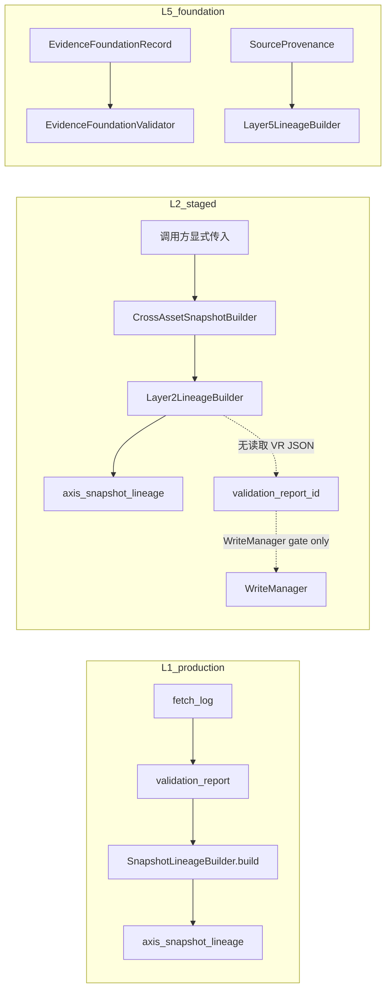

# R3Y-AUD-05 — Lineage / evidence foundation 反证

**Result: WARN**

Worktree: `quant-monitor-desk-wt-review-r3-post-r3x-strict-audit` · 基准 `master` @ `61436a51`  
审计模式：只读 · 未修改实现 / 测试 / registry  
Agent: `r3y-aud-05-lineage` · 模板: `agents/audit-a5-completion.md`

---

## 目标与反证假设

**R3Y §4 必答：** Layer2 / Layer5 是否正确传播 `source_fetch_ids`、`source_content_hashes`、`as_of`、`no-future-data`？与真实 `fetch_log` → `validation_report` lineage 是否兼容？

**反证假设：**

1. 若 Layer2/Layer5 仅在 builder 层校验字段非空，但 **不** 从 `validation_report` / `fetch_log` 拉取并绑定 ID，则 staged 测试可绿而 production 路径可写入 **与 gate 无关的合成 lineage**。
2. 若 Layer1 已有 `fetch_log → validation_report → axis_snapshot_lineage` 端到端测，而 Layer2/Layer5 缺失对等测试，则「lineage 闭合」宣称对 L2/L5 不成立。
3. 若 Layer5 foundation 与 Layer5 lineage 对 provenance 要求不一致，则 evidence 记录可通过校验但无法安全进入 snapshot lineage。

---

## 读取文件（含 call path 追溯）

| 类别 | 路径 |
|------|------|
| 派发矩阵 | `.trellis/tasks/06-23-round3-post-r3x-strict-audit/research/parallel-audit-dispatch.md` |
| R3Y issue 定义 | `docs/implementation_tasks/ROUND_3_ADVERSARIAL_AND_DATA_PILOT/R3Y_post_r3x_strict_adversarial_audit.md` §4 R3Y-AUD-05 |
| Lineage 契约 | `specs/contracts/snapshot_lineage_contract.yaml` |
| L1 对照（fetch→VR→lineage） | `backend/app/layer1_axes/lineage.py` L55–117、`backend/app/layer1_axes/observation_contract.py` L63–68 |
| Layer2 核心 | `backend/app/layer2_sensors/lineage.py`、`snapshot_builder.py`、`snapshot_writer.py`、`observation.py`、`observation_writer.py` |
| Layer5 核心 | `backend/app/layer5_evidence/foundation.py`、`lineage.py`、`models.py` |
| 共享 kernel | `backend/app/core/snapshot_lineage.py` |
| 必跑测试 | `tests/test_layer2_sensor_loader.py`、`tests/test_layer5_evidence_foundation.py` |
| L1 端到端对照测 | `tests/test_layer1_observation_ingestion.py::test_layer1Observation_lineageIncludesFetchIdsAndHashes` |

### Call path 摘要



---

## 核查方法（code trace + pytest）

### 1. Layer2 lineage 传播

| 检查项 | 实现 | 结论 |
|--------|------|------|
| `source_fetch_ids` / `source_content_hashes` 非空 | `Layer2LineageBuilder.build` L44–47 | ✅ 强制非空 |
| 写入 `axis_snapshot_lineage` | `Layer2SnapshotWriter._write_on_connection` L147–166 + `lineage_row_to_db_tuple` | ✅ JSON 序列化入库 |
| 从 `validation_report` 读取 fetch/hash | **无**；`CrossAssetSnapshotBuilder.build_daily_snapshots` 要求调用方传 tuple L64–65 | ⚠️ 与 L1 模式断裂 |
| `validation_report_id` 与 lineage ID 一致性 | WriteManager 仅校验 report 存在/通过；**不**比对 lineage 内 ID | ⚠️ 可漂移 |
| `no-future-data` | `reject_future_observation` / `filter_observations_for_as_of`（trade_time、as_of_timestamp、fetch_time） | ✅ 观测层三重边界 |
| `as_of` vs `input_data_window_end` | `snapshot_builder` 以 `max(o.as_of_timestamp)` 为 window_end；无 `Layer2LineageBuilder` 级 `as_of > window_end` 守卫（依赖观测过滤） | ✅ staged 路径自洽；⚠️ L5 有显式检查 L2 无 |
| `source_dataset_ids` agent 过滤 | 共享 `validate_source_dataset_ids` | ✅ |

### 2. Layer5 evidence foundation

| 检查项 | 实现 | 结论 |
|--------|------|------|
| factual provenance 可追溯 | `_validate_provenance_traceable`：fetch **或** hash 即可 L105–110 | ✅ foundation 层 |
| lineage 构建 | `Layer5LineageBuilder`：fetch **与** hash 均必填 L87–90 | ⚠️ 严于 foundation |
| `as_of` 边界 | `as_of > input_window_end` → `Layer5LineageError` L91–92 | ✅ 代码存在 |
| `no-future-data` on observations | foundation 模块 **无** 观测时间边界校验 | ⚠️ 023A 最小切片；非完整 ingestion |
| agent 文本拒作 fact source | `reject_agent_text_as_fact_source` + dataset_ids 模式 | ✅ |

### 3. 与真实 source lineage 兼容性

- **Layer1：** `SnapshotLineageBuilder` 从 `ValidationReportRef.source_fetch_ids_json` / `source_content_hashes_json` 解析（`layer1_axes/lineage.py` L77–107）；`test_layer1Observation_lineageIncludesFetchIdsAndHashes` 经 Phase4 commit 断言 DB 中 lineage 非空且与 fetch 链一致。
- **Layer2：** `cross_asset_observation` 表 **无** `fetch_id` 列；trace 契约在 L1 文档化为 `validation_report.*_json`（`observation_contract.py` L63–68），**Layer2 未实现同等 VR→lineage 绑定**。测试 `_insert_validation_report` 手工插入 VR，但 builder 仍用独立 synthetic tuple（`test_layer2Snapshot_writeViaWriteManager` L584–585 vs L95–96），且 DB 断言仅 `layer_id == 'layer2'`（L596–600），**未**读 `source_fetch_ids` 列。
- **Layer5：** 当前为 validator + lineage envelope 契约；**无** DB 写入、**无** `fetch_log` 集成；`STAGED_PROVENANCE` 全系 synthetic（`test_layer5_evidence_foundation.py` L40–44）。

### Pytest 执行记录（必跑）

```text
cd quant-monitor-desk-wt-review-r3-post-r3x-strict-audit
uv run pytest tests/test_layer2_sensor_loader.py tests/test_layer5_evidence_foundation.py -q
```

| 指标 | 结果 |
|------|------|
| 收集用例 | 38 |
| 通过 | 38 |
| 失败 | 0 |
| 跳过 | 0 |
| 耗时 | ~12.2s |
| exit code | 0 |

**测试深度结论：** Layer2 对 no-future、double-count、ResourceGuard、WriteManager 路径覆盖 **runtime-strong**；lineage 字段与 hash 传播为 **runtime-medium**（内存 envelope 断言）；**缺少** fetch_log/VR→lineage 端到端与 DB lineage 列断言。Layer5 为 **runtime-medium** 纯函数校验，无 ingestion 链。

---

## Findings（HIGH / WARN，文件:行号）

### HIGH

（本 issue 范围内未发现数据损坏或安全旁路级 Critical；staged-only 门禁仍有效。）

### WARN

| ID | 文件:行号 | 描述 | 建议 |
|----|-----------|------|------|
| **L05-W1** | `backend/app/layer2_sensors/snapshot_builder.py:64-65` · `lineage.py:44-47` · 对照 `layer1_axes/lineage.py:77-107` | Layer2 lineage ID/hash **由调用方注入**，不从 `validation_report` 解析；WriteManager 的 `validation_report_id` 不约束 envelope 内容。与 L1 production lineage 模式 **不兼容**，存在 VR 写 `fetch-A`、lineage 写 `fetch-B` 的漂移窗口。 | 新增 `Layer2LineageBuilder.build_from_validation_report(...)` 或 commit 前 assert envelope IDs ⊆ VR JSON；补端到端测 mirroring `test_layer1Observation_lineageIncludesFetchIdsAndHashes`。 |
| **L05-W2** | `tests/test_layer2_sensor_loader.py:569-600` · `70-97` | WM 集成测插入 VR 含 `fetch-l2-wm`，但 **未**断言 `axis_snapshot_lineage.source_fetch_ids` / `source_content_hashes` 与 VR 或 builder 输入一致；全库无 `fetch_log`→Layer2 lineage 测试。 | 扩展 `test_layer2Snapshot_writeViaWriteManager` 读取 lineage JSON 列；或新增 Phase4 式 micro-fetch→L2 snapshot 测（staged fixture）。 |
| **L05-W3** | `backend/app/layer5_evidence/foundation.py:104-110` · `lineage.py:87-90` · `tests/test_layer5_evidence_foundation.py`（无 `as_of` 越界用例） | Foundation 允许 provenance **仅 hash 或仅 fetch**；Lineage builder **两者必填**。`as_of > input_window_end` 守卫存在但 **无测试**；foundation 无 no-future 观测校验。 | 统一 provenance 规则或文档化「foundation record ≠ lineage envelope」；补 `test_layer5Lineage_rejectsAsOfAfterWindowEnd` 与 hash-only/fetch-only 负例。 |

### 正向观察（What's Done Well）

- Layer2 `reject_future_observation` 对 `trade_time` / `as_of_timestamp` / `fetch_time` 三重 no-future 与契约测试名 `test_snapshotRejectsFutureInput` 等对齐（`specs/contracts/snapshot_lineage_contract.yaml` L26–28）。
- 共享 `snapshot_lineage` kernel（`LINEAGE_REQUIRED_FIELDS`、`lineage_row_to_db_tuple`）保证 L2/L5 与 L1 DB 列形状一致。
- Layer2 staged 路径 fail-closed：`staged_fixture_only` registry、`tdx_pytdx` 拒绝、axis-input double-count、ResourceGuard 集成均有 runtime 测试。
- Layer5 agent-as-fact-source 拒绝逻辑覆盖 `created_by`、summary 标记、`source_dataset_ids` 三通道。

---

## 反证结论（修复是否进入 runtime）

| 维度 | 判定 | 说明 |
|------|------|------|
| Layer2 字段级 lineage + no-future | **部分进入 runtime** | Builder/Writer/Observation 路径已实现；staged 测试绿 |
| Layer2 与真实 fetch_log lineage | **未闭合** | 无 VR 绑定；测试 synthetic；与 L1 不对等 |
| Layer5 foundation 校验 | **进入 runtime（最小切片）** | Validator + lineage envelope 可测 |
| Layer5 与 production fetch 链 | **未实现** | 023A 范围外；无 DB/fetch 路径 |
| 整体 issue | **WARN** | staged 门禁可信；production lineage 兼容性不足以支撑「与真实 source 完全兼容」宣称 |

---

## 阻塞项 / 建议

**阻塞 pilot v2 / data health v1？** 不单独 BLOCK（属 AUD-08 汇总项）。本 issue 建议在进入 **非 staged** Layer2 写路径或 Layer5 ingestion 前闭合 L05-W1/W2。

**建议下一步（实现任务，非本 audit 分支）：**

1. Layer2：复用 `ValidationReportRef` 模式，从 VR JSON 填充 lineage，并在 snapshot commit 前校验一致性。
2. 测试：对标 L1317–1347 `test_layer1Observation_lineageIncludesFetchIdsAndHashes` 增加 Layer2 DB lineage 列断言。
3. Layer5：对齐 foundation vs lineage provenance 规则；补 `as_of` 边界负例测试。

---

## Verification Story

| 项 | 状态 |
|----|------|
| 必跑 pytest 已执行 | ✅ 38/38 passed |
| 代码 trace L2/L5 + L1 对照 | ✅ |
| GitNexus impact | 未调用（只读审计，无符号编辑） |
| green.txt 抽检 | 不适用（review 任务，非 Execute §8 步） |
| audit-prod-path | 不适用（registry §2.1 未冻结为本 issue 门禁） |

---

## AC 评分（A5 rubric · 本 issue 映射）

| AC# | 追溯链 | 分数 | 说明 |
|-----|--------|------|------|
| R3Y-Q7 | R3Y §3 Q7 → Layer2/L5 代码 + 必跑 pytest | **3** | 实现存在；与真实 source lineage 链缺一环 |
| no-future-data | contract → `observation.py` → 6 个 L2 测试 | **4** | 观测层强；L5 未覆盖 |
| source_fetch_ids/hashes | builder 非空 + L2 内存断言 | **3** | 无 VR/fetch_log 绑定证据 |

**不以自述为 PASS** — 以上结论以 pytest exit 0 + 源文件行号为准。
