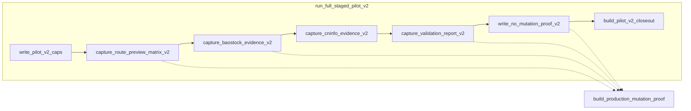

# A6 audit-perf — Phase 7 复审计（B-19 staged pilot v2）

> **维度：** A6 · performance-engineer（只读）  
> **模型：** composer-2.5  
> **工作区：** `quant-monitor-desk-wt-r3-pilot-v2`  
> **提交：** `fb044931` — `feat(ops): close B-19 staged pilot v2 Execute+Audit`  
> **任务：** `06-24-round3-real-data-staged-pilot-v2`（R3Y 任务卡）  
> **日期：** 2026-06-24  
> **模式：** Audit（只读，无 commit、无业务代码修改）

---

## 总判定

| 项 | 值 |
|----|-----|
| **判定** | **SKIP**（与 `AUDIT.plan.md` §1 / §2.2 一致） |
| **BLOCKING** | 0 |
| **§3.6 性能指标复跑** | **未执行** — 本任务无冻结 SLA / smoke 阈值 |

---

## 1. 启动清单

| 项 | 状态 |
|----|------|
| `agents/audit-adversarial-authority.md` | 已读（主仓 `agents/`） |
| `agents/performance-engineer.md` | 已读 |
| `R3Y_real_data_staged_pilot_v2.md` §6 默认样本边界 | 已读 |
| `AUDIT.plan.md` §1 A6、§2.2 A6 SKIP | 已读 |
| `MASTER.plan.md` §10 | 已读 — **仅 Tier A/B pytest，无 perf gate 行** |
| `backend/app/ops/staged_pilot.py` | 已读（v1 + v2 热路径） |
| `backend/app/ops/mutation_proof.py` | 已读 |
| `backend/app/core/resource_guard.py` | 已读（接口与 Decision 语义） |
| `backend/app/ops/staged_pilot_fetch_ports.py` | 已读（有界 fetch） |
| 首轮 `research/audit-evidence/a6.md` | 已读（基线 SKIP） |

**约束：** 只读；未跑 smoke / cProfile；未改码；未 commit。

---

## 2. SKIP 理由（§3.6 对应）

依据 `AUDIT.plan.md` §2 A6 行与 §2.2，以及 `audit-adversarial-authority.md` A6 行「Plan 标 SKIP 时仍须写 SKIP 理由 + 计划外 perf 风险」：

### 2.1 任务性质 — 非生产 hot path

| 依据 | 说明 |
|------|------|
| R3Y 任务卡 | **staged-only** 证据采集；`production_clean_write: false`；非 batch 管道 SLA 任务 |
| MASTER §10 | 冻结验收 = **pytest Tier A/B**；**无** `production_equivalent_smoke` 耗时行、**无** batch perf gate、**无** p95 / 内存峰值阈值 |
| AUDIT.plan §2.2 | 明示「受控小样本 staged pilot，无 SLA」 |
| 样本量级 | R3Y §6：`max_symbols` 5、`max_rows` 500、`max_network_calls` 25；`full_market_scan` / `full_history_backfill` 禁止 |

本切片目标是 **授权边界内的证据与 mutation proof 语义**，不是优化或证明端到端 ingest 吞吐。

### 2.2 无冻结 perf 证据可复跑

`performance-engineer.md` 要求：**指标 = MASTER/AUDIT 冻结阈值 + 同一命令前后对比**。本任务：

- `AUDIT.plan` 未定义 smoke 命令、ResourceGuard 峰值 MB、DuckDB profiling 阈值；
- Execute `implement.jsonl` / §8 证据均为 **功能正确性**（RED→GREEN pytest），非 perf benchmark；
- 对抗性复跑 perf 将 **发明 KPI**，违反审计纪律。

因此 A6 **正式维度 SKIP**；下文 §4 为 **计划外静态风险扫描**（非 SKIP 的替代验收）。

### 2.3 与 v1 pilot 对比

v1 `run_full_staged_pilot` 在 live fetch 前写入 `resource_guard_caps.json` 并检查 `ResourceGuard`（`staged_pilot.py:1170-1202`）。v2 全链路 **未继承该运行时快照**（见 §4 计划外 OOF-P2 / OOF-P5）。在当前 **mock / 小样本 / skip_live_fetch 为主** 的 Execute 证据下，不构成 SLA 违约，但属 **扩展 live 样本前的资源门禁缺口**。

---

## 3. §3.6 — 指标 | 阈值 | 实测 | 证据

| 指标 | 冻结阈值（AUDIT/MASTER） | 实测 | 证据 |
|------|--------------------------|------|------|
| staged pilot 端到端耗时 | **未冻结** | — | SKIP |
| smoke `production_equivalent_smoke.py` | **未列入本任务 §10** | — | SKIP |
| ResourceGuard 峰值 / HARD_STOP 行为 | R3Y §6 原则性要求；**无数值阈值** | 静态：v2 全链路未 gate live fetch | §4 OOF-P2 |
| 网络调用预算 | R3Y §6：`max_network_calls_per_run: 25` | 静态：运行时 budget 默认 **10** | §4 OOF-P1 |
| mutation proof I/O | **未冻结** | 静态：多次全库 COUNT + `read_bytes` | §4 OOF-P3 |
| pytest 慢测 | §10 Tier A/B（功能） | 未跑 `--durations`（非 A6 冻结项） | SKIP |

**§3.6 结论：** 全部 **SKIP** — 无违背已冻结 perf 契约（因契约不存在）。

---

## 4. 计划外 perf / 资源风险扫描（静态）

> 对抗性范围：`staged_pilot.py` v1/v2 热路径、`mutation_proof.py`、R3Y §6 caps、`ResourceGuard` 接线、fetch port 有界性。已对照 `AUDIT.plan` Trace 与 MASTER §8，**不因 §8 已绿而降级**。

### 4.1 staged_pilot 热路径（读代码）

| 阶段 | 网络 | DB 写 | prod DB 读 | 备注 |
|------|------|-------|------------|------|
| route preview v2 | 无（dry_run） | 无 | `key_table_row_counts` + 可选 `read_bytes` | `_route_status_examples_for_v2` 额外 3 次 planner（内存内） |
| baostock/cninfo live | 1× `consume()` / 次 `run_staged_pilot_raw_only` | sandbox `writer()` only | 每次 fetch 前后各 1 次 mutation proof | v2 默认 2 次 live（若未 skip） |
| validation v2 | 无 | 无 | 再 1 次 mutation proof | 加载 raw JSON 入内存（有 `max_rows` 上界） |
| closeout | 无 | 无 | 再 1 次 mutation proof | 无 before 快照时重复全量 COUNT |

**热路径特征：** CPU 轻、**prod DuckDB 只读探测重复**、网络受 coarse budget 约束（见下）。

### 4.2 网络 caps — 声明 vs 执行

| 层 | 值 | 位置 |
|----|-----|------|
| R3Y §6 / `pilot_v2_caps.json` | `max_network_calls_per_run: 25` | 任务卡 + `execute-evidence/pilot_v2_caps.json` |
| v2 常量 | `MAX_NETWORK_CALLS_V2 = 25` | `staged_pilot.py:1271,1318` |
| **运行时 budget** | `_NetworkCallBudget(limit=MAX_NETWORK_CALLS_PER_RUN)` → **10** | `staged_pilot.py:50,154-163` |
| 消耗粒度 | 每次 `run_staged_pilot_raw_only` 调用 **1** 次 `consume()` | `staged_pilot.py:735`；与 port 内 login/query 次数 **脱钩** |

当前 v2 批准信封（baostock + cninfo 各 1 run ≈ 2 consumes）**低于 10**，Execute 未触发 cap。但若协调者按 caps JSON **扩到 >10 次 fetch / run**，会在 **25 之前** 被 v1 常量误杀 — **证据与执行不一致**。

### 4.3 ResourceGuard

| 检查点 | v1 `run_full_staged_pilot` | v2 `run_full_staged_pilot_v2` |
|--------|---------------------------|-------------------------------|
| fetch 前 `ResourceGuard.check()` | ✅ 有；HARD_STOP 则 skip live | ❌ **无** |
| `preview_staged_pilot` 内 guard | ✅ `svc.check_resource_guard()` | ✅ 同（仅 route preview 路径） |
| 证据产物 | `resource_guard_caps.json` | 仅静态 `pilot_v2_caps.json`（无 decision/reason 快照） |

R3Y §6：「更大样本须 … ResourceGuard caps」— v2 caps JSON 满足 **声明**；**运行时 gate** 在 v2 全链路缺失，属扩展样本前的 NON-BLOCKING 缺口。

### 4.4 无界 fetch — 静态结论

| 控制 | 实现 | 评估 |
|------|------|------|
| `validate_pilot_v2_authorization` | `max_rows ≤ 500`，`len(symbols) ≤ 5`，信封白名单 | ✅ 授权层有界 |
| Fetch ports | `frame.tail(max_rows)`；baostock 循环 `break` at `max_rows` | ✅ 行数有界 |
| `run_staged_pilot_raw_only` | 仅 `symbols_or_indicators[0]` 进入 `FetchRequest` | ⚠️ 多 symbol 信封 **未** 转化为多 fetch（功能/覆盖问题；非无界，但 caps 语义部分闲置） |
| fixture 禁止 | `_assert_real_fetch_port` | ✅ |
| sandbox 路径 | `is_relative_to(sandbox_root)` | ✅ |

**无界 fetch 风险：低** — 在现行授权与 port 实现下，未见「全市场 / 全历史」旁路；主要风险是 **caps 文档与 budget 实现不一致**（§4.2），非无界 I/O。

### 4.5 mutation_proof.py — prod 只读成本

`build_production_mutation_proof`（`mutation_proof.py:78-139`）在 DB 存在时：

1. `key_table_row_counts` + `all_table_row_counts` — 对 **每张 main 表** `COUNT(*)`；
2. `resolved.read_bytes()` — **整文件读入内存**（before/after 各一次，默认同文件则仍读两遍）。

v2 单次 e2e 可触发 **≥4 次** 全量 proof（route、各 fetch、validation、closeout）。对 **小型或缺失** prod DB（本 worktree 常态）可忽略；对 **大型生产 DuckDB**，属 **只读延迟 / 内存尖峰** 计划外面 — 未在 AUDIT/MASTER 冻结，**NON-BLOCKING**，但 PROMPT_20 扩样本时应合并 before 快照或降频 proof。

---

## 5. 计划外发现

> 对抗性搜索已完成：对照 R3Y §6、`staged_pilot.py` v1/v2 差异、`mutation_proof.py` 调用点、`ResourceGuard` 接线、fetch port 有界性、Execute `pilot_v2_caps.json`。**不得**因 MASTER §8 pytest 已绿而标「已覆盖」。

| ID | 级别 | 发现 | 证据 | 建议 |
|----|------|------|------|------|
| **OOF-P1** | NON-BLOCKING | v2 caps 声明 **25** 次网络预算，运行时 `_NetworkCallBudget` 仍默认 **10**（v1 常量） | `staged_pilot.py:50,154,1271,1318`；`pilot_v2_caps.json` | 扩样本前：`reset_network_call_budget` 传入 `MAX_NETWORK_CALLS_V2`，或统一 SSOT |
| **OOF-P2** | NON-BLOCKING | `run_full_staged_pilot_v2` **未** 在 live fetch 前检查 `ResourceGuard`（v1 有） | `staged_pilot.py:2019-2045` vs `1170-1192` | 对齐 v1：HARD_STOP 时 skip live + 写入 guard 快照 |
| **OOF-P3** | NON-BLOCKING | mutation proof 重复全库 COUNT + `read_bytes`；v2 热路径多次调用无共享 before 快照 | `mutation_proof.py:110-119`；`staged_pilot.py` 多处 `build_production_mutation_proof` | 大 DB 环境：单次 run 复用 before 快照；或 AUDIT 扩样本任务冻结 proof 频率 |
| **OOF-P4** | NON-BLOCKING | v2 baostock 信封 3 symbols，live 路径只 fetch `symbols[0]` | `staged_pilot.py:762-768` vs `V2_BAOSTOCK_SYMBOLS` | 功能切片外；扩样本时明确「每 symbol 一次 fetch」与 network budget 关系 |
| **OOF-P5** | NON-BLOCKING | v2 不产出 `resource_guard_caps.json` 运行时证据（v1 有 decision/reason/budget） | v1 `RESOURCE_GUARD_JSON` vs v2 仅 caps JSON | closeout / ops 审计可追溯性；可选对齐 v1 字段 |
| **OOF-P6** | NON-BLOCKING | 网络 budget 按 **pilot run** 计次，非 vendor HTTP 调用次数（baostock login+query 算 1） | `staged_pilot.py:735`；`live_pilot_fetch_ports.py:131-153` | 粗粒度可接受于 micro-pilot；扩样本时勿误以为 budget=HTTP 次数 |

**BLOCKING：** 0 — 在 **当前受控小样本 + SKIP 范围** 内，无已冻结 perf 阈值的违背，也无可导致无界生产 fetch 的旁路。

---

## 6. DOUBT（A6 checklist）

| 问题 | 结论 |
|------|------|
| 指标在声明 sandbox 量级下是否成立？ | **N/A** — 未冻结指标 |
| Execute evidence 与 Audit 是否同命令复跑？ | **SKIP** — 无 perf 命令 |
| SKIP 是否仅在 §3.6 注明理由？ | ✅ 本文 §2 + §3 |
| 计划外 perf 风险是否已扫描？ | ✅ §4 + §5 |

---

## 7. 汇总结论

- **A6 正式判定：SKIP** — 与 `AUDIT.plan` 一致；理由：staged micro-pilot、无 SLA、MASTER §10 无 perf gate、无冻结 benchmark 可复跑。
- **计划外扫描：** 发现 6 项 **NON-BLOCKING** 资源/一致性风险（caps 25 vs budget 10、v2 缺 ResourceGuard gate、mutation proof 重复 I/O 等）；**不构成** 本轮 Audit FAIL。
- **若未来升格 perf 审计：** 须在 MASTER/AUDIT 冻结 smoke 命令 + 数据量级 + ResourceGuard 数值阈值后，再跑 **同一命令** 前后对比（`performance-engineer.md` 纪律）。

---

*Phase 7 A6 · composer-2.5 · 只读 · 无 commit*
