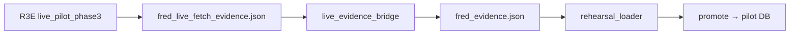

# Project Overview — R3H-01 (Plan 1a)

> GitNexus `query` + 活卡阅读 · 2026-06-28

## 模块地图

```text
backend/app/datasources/fetch_ports/     ← 目标：fred_port 等（多数尚不存在）
backend/app/datasources/normalizers/     ← official_macro.py, sec_edgar.py
backend/app/core/resource_guard.py       ← caps
backend/app/ops/sandbox_clean_write/     ← 3G promote 链（rehearsal_loader, bridge）
backend/app/ops/live_pilot_phase3.py     ← R3E FRED live fetch 证据产出
specs/datasource_registry/               ← source_registry + capabilities（协调改）
tests/test_official_macro_adapters.py    ← 目标测试模块（待建或扩展）
```

## 当前 fred 状态

| 维度         | 状态                                                                            |
| ------------ | ------------------------------------------------------------------------------- |
| registry     | `fred` disabled-by-default, Primary, macro_series, requires_user_setup          |
| fetch port   | **无** `fred_port.py`；live 经 `live_pilot_phase3` + sandbox pilot              |
| promote      | `rehearsal_loader._fred_staging_rows` 读 `fred_evidence.json`                   |
| live→promote | `live_evidence_bridge.materialize_fred_promote_evidence`（pilot hack）          |
| 测试         | `test_round3g_*`, `test_fred_staged_semantics`, `test_batch275_live_pilot_gate` |

## 兄弟源（同卡）

`us_treasury`, `sec_edgar`, `cftc_cot`, `bis`, `world_bank` — registry 有 proposed-disabled 条目，adapter 路径在活卡 §4，实现度低于 fred。

## 执行流（G10 相关）



**3H 目标流：** A → 统一契约 → E（无 C sidecar）。
