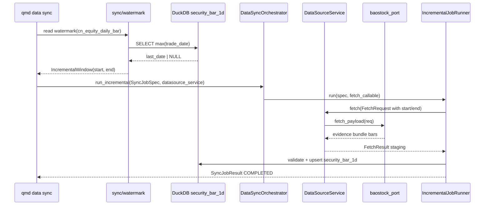

# R3-DCP-01 架构落地 — baostock incremental

> 可选调研产物 · Execute 前读 `reference-adoption-dcp01.md` + 本文。

---

## 端到端数据流



---

## 模块触点

| 层 | 文件 | 变更类型 |
|----|------|----------|
| Watermark | `backend/app/sync/watermark.py`（新建） | `read_bar_trade_date_watermark`, `compute_incremental_window` |
| Runner | `backend/app/sync/runners.py` | L2：FetchRequest 填 `start_time`/`end_time` from spec |
| Orchestrator | `backend/app/sync/orchestrator.py` | 可能 **只读**；或 CLI 直调 `run_incremental` 不改 orchestrator |
| Service | `backend/app/datasources/service.py` | L1 复用 |
| Port | `backend/app/datasources/fetch_ports/baostock_port.py` | L2：窗内 bar 过滤 |
| Adapter | `backend/app/datasources/adapters/baostock.py` | 可能 L1 复用 skeleton |
| CLI | `backend/app/cli/data_commands.py`, `main.py` | L2：`sync` baostock/cn_equity 真跑 |
| Clean SSOT | `clean_write_targets.py` | L1：`security_bar_1d` |
| Tests | `tests/test_baostock_incremental_watermark.py` 等 | 新建 |

---

## Watermark 契约（建议 API）

```python
@dataclass(frozen=True)
class IncrementalWindow:
    date_start: date
    date_end: date
    watermark: date | None  # None = empty table

def read_bar_trade_date_watermark(
    con,
    *,
    clean_table: str = "security_bar_1d",
    instrument_id: str | None = None,
    adjustment_type: str = "none",
) -> date | None: ...

def compute_incremental_window(
    watermark: date | None,
    *,
    end: date | None = None,  # default UTC today
    empty_table_lookback_days: int = 30,
) -> IncrementalWindow: ...
```

**边界日：** `max(trade_date)=2026-06-28` → `date_start=2026-06-29`；`date_end` inclusive 至 today。

**空表：** `date_start = today - empty_table_lookback_days`（可配置常量，Execute 用 fixture 友好值）。

---

## 共享文件协调（轨 B）

| 文件 | 轨 A 策略 |
|------|-----------|
| `runners.py` | 仅加 date→FetchRequest 注入；fred 受益，轨 B 只读或 rebase 后接 |
| `watermark.py` | 轨 A 拥有；提供 bar 域 `trade_date` 与 macro 域扩展点（docstring 预留 `observation_date` 别名，实现留轨 B） |
| `source_registry.yaml` | 仅 baostock 行；主会话 merge |

---

## 测试策略

| 层级 | 文件 | 证明什么 |
|------|------|----------|
| Unit | `test_baostock_incremental_watermark.py` | 空表 / 有数据 / 边界日 +1 |
| Integration | 同上或 `test_baostock_incremental_e2e.py` | replay fixture + service + orchestrator → `security_bar_1d` |
| Idempotency | 同上 | 连续两次 run → row count 不变 |
| CLI | `test_qmd_data_sync_baostock.py` | `--dry-run` JSON 含 window；真跑 mock/replay |

**隔离：** `tmp_path` DuckDB + `QMD_DATA_ROOT` monkeypatch；live 须 `QMD_ALLOW_LIVE_FETCH` gate。

---

## 非目标（架构层）

- FullLoad / Backfill 产品化
- CN 交易日历完整闭合（R3H-03 后续）
- 扩 Tier A 其他源（Wave 4 DCP-05）
- 新 migration / 新 clean 表
