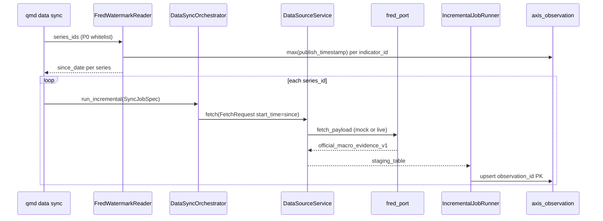

# R3-DCP-02 架构方案 — fred macro incremental

> **读者：** Execute agent · Plan-Audit  
> **SSOT 调研：** `research/reference-adoption-dcp02.md`

---

## 1. 端到端数据流



---

## 2. Watermark 语义（本票核心差异）

| 维度 | baostock（轨 A） | fred（轨 B） |
|------|------------------|--------------|
| clean 表 | `security_bar_1d` | `axis_observation` |
| 实体键 | `instrument_id` | `indicator_id`（= FRED `series_id`） |
| 水位字段 | `trade_date` | `DATE(publish_timestamp)`（证据 `observation_date` 映射） |
| 下一窗起点 | `max(trade_date) + 1 交易日` | `max(observation_date) + 1 日历日` |
| PK / 幂等 | bar PK upsert | `observation_id` UUID5 upsert |

**空表冷启动：** 无行时 `since = today - min(MAX_WINDOW_DAYS, cap)`（与 `fred_port.MAX_WINDOW_DAYS=120` 对齐）。

**多 series：** 每个 `series_id` 独立水位；测试须覆盖「A 有数据、B 空表」组合。

### 2.1 Watermark 模块归属

```text
优先：消费轨 A backend/app/sync/watermark*.py 中宏观专用 API（若已 merge）
  — 必须 per indicator_id + observation_date/publish_timestamp 语义
  — 禁止调用 bar 域 read_*trade_date* 函数（轨 A baostock 专用）
回退：backend/app/ops/fred_incremental_watermark.py（ponytail 局部实现 + 注释升级路径）
禁止：与轨 A 同时改 sync/watermark*.py · orchestrator.py · runners.py
```

---

## 3. 组件触点

| 层 | 文件 | 变更类型 |
|----|------|----------|
| Watermark | `ops/fred_incremental_watermark.py`（新建）或 `sync/watermark.py`（只读 import） | L3/L1 |
| Port | `fetch_ports/fred_port.py` | L2：`start_time` → `observation_start` |
| Orchestrator | `sync/orchestrator.py` | **禁止本轨修改**；调用方传 macro `PipelineConfig`（`primary_keys`/`required_fields`） |
| Runner | `sync/runners.py` | **禁止本轨修改**；受益轨 A date→`FetchRequest` 注入后可只读消费 |
| CLI | `cli/data_commands.py` · `cli/main.py` | L2：扩展 `sync` 支持 `--domain macro_series --source-id fred` 真跑（现状仅 `--domain`，无 `--source`） |
| Ops smoke | `ops/fred_incremental_run.py`（可选薄封装） | L3 编排 |
| Tests | `tests/test_fred_macro_incremental*.py` | 新建 |

---

## 4. FetchRequest / SyncJobSpec 约定

```python
# 概念契约（Execute 实现时照此）
FetchRequest(
    run_id=...,
    source_id="fred",
    data_domain="macro_series",
    instrument_id="DGS10",          # series_id
    start_time="2026-01-02",          # watermark + 1 day (ISO date)
    end_time=None,                    # ponytail: 默认 today UTC
)

SyncJobSpec(
    job_type="incremental",
    source_id="fred",
    data_domain="macro_series",
    instrument_id="DGS10",
    ...
)

orchestrator.run_incremental(
    spec,
    datasource_service=service,
    clean_table="axis_observation",
    primary_keys=("observation_id",),
    required_fields=("raw_value", "source_used"),  # 对齐 macro validator
    write_mode="upsert_by_pk",
)
```

---

## 5. 授权与环境门

| 检查 | 条件 | 失败码 |
|------|------|--------|
| Live fetch | `QMD_ALLOW_LIVE_FETCH=1` | `LIVE_FETCH_REJECTED` |
| FRED key | `FRED_API_KEY` 非空 | `USER_AUTH_REQUIRED` |
| 数据根 | `QMD_DATA_ROOT` 指向隔离路径 | 测中 monkeypatch tmp_path |
| ResourceGuard | `OK` | `RESOURCE_GUARD_PAUSED` |
| Replay | `use_mock=True` 或 fixture replay | 无网络 |

---

## 6. 测试分层

| 层 | 内容 | 命令示例 |
|----|------|----------|
| Unit | watermark 空/有/多 series | `pytest tests/test_fred_macro_incremental_watermark.py -q` |
| Integration replay | mock port + orchestrator 写隔离库 | `pytest tests/test_fred_macro_incremental_e2e.py -q -k replay` |
| Live smoke | env-gated；`@pytest.mark.skipif` 无 key | `-k live_smoke` |
| Idempotency | 连续两次 run；`COUNT(*)` 不变 | 同文件 `-k idempotent` |
| CLI | `qmd data sync --domain macro_series --source-id fred --dry-run` + 真跑（测中） | `tests/test_fred_macro_incremental_cli.py` |
| Negative | 无 `FRED_API_KEY` live → `USER_AUTH_REQUIRED` | 负例单测 |

---

## 7. 非目标（架构层）

- 不引入新 staging 表 / migration
- 不扩 P0 series whitelist（仍 `fred_port.P0_SERIES_WHITELIST`）
- 不接 Layer1 micro-ingestion 旁路（走 Sync WritePipeline 与既有 macro staging 路径）
- 不等待 DCP-01 完成才开工；水位模块可局部实现后对齐轨 A

---

## 8. 风险与缓解

| 风险 | 缓解 |
|------|------|
| 轨 A/B 争用 `sync/watermark*.py` | 协调手册 §4：A 拥有；B 只读或 ops 局部 |
| `observation_id` 修订导致重复行 | upsert_by_pk + content_hash 变更走 revision（Wave 4 defer） |
| CLI `sync_plan` 仅 dry-run | 本票 P5 切片显式扩展 |
| 生产库误写 | `DATA_ROOT` / `QMD_DATA_ROOT` 测中隔离；负向测 canonical 路径 |
