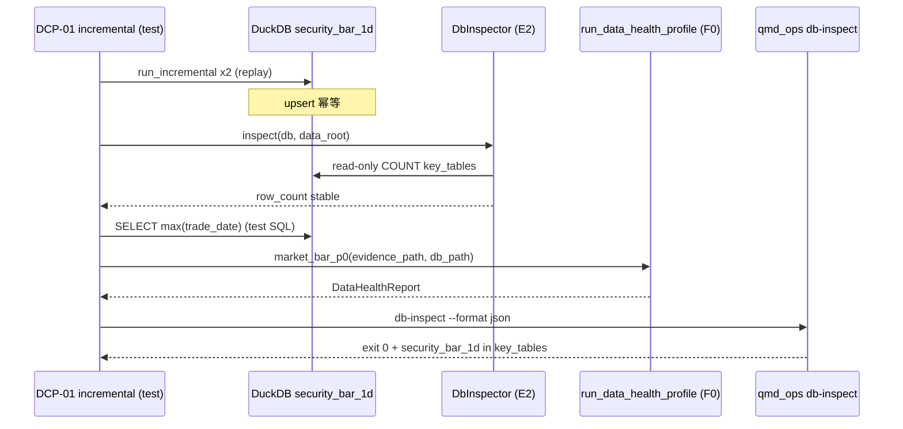

# R3-DCP-03 架构落地 — 写后抽检

> 可选调研产物 · Execute 前读 `reference-adoption-dcp03.md` + 本文。

---

## 端到端数据流

---

## 模块触点

| 层       | 文件                                           | 变更类型                                    |
| -------- | ---------------------------------------------- | ------------------------------------------- |
| Tests    | `tests/test_incremental_post_write_inspect.py` | **新建** 集成测                             |
| Tests    | `tests/post_write_inspect_support.py`（可选）  | **新建** bundle helper                      |
| E2       | `backend/app/ops/db_inspector.py`              | **默认不改**（仓内复用）                    |
| F0       | `backend/app/ops/data_health_profiles/*`       | **默认不改**（仓内复用）                    |
| CLI      | `scripts/qmd_ops.py`                           | **默认不改**（仓内复用）                    |
| Contract | `ops_db_inspect_contract.yaml`                 | **不改**（除非 Audit 要求补 deferred 映射） |

---

## 测试编排（建议）

1. 复用 `test_baostock_incremental_e2e` 同款 bootstrap：`_bootstrap_db`、`_build_service`、replay fixture。
2. 跑两次 `_incremental_spec` + `orch.run_incremental`。
3. `DbInspector(db, raw_root).inspect()` → 解析 `security_bar_1d` 的 `row_count`；两次 inspect 或 before/after 第二次跑断言相等。
4. `ConnectionManager.reader()` → `max(trade_date)` ≥ fixture 日。
5. 从 `fetch_log.raw_file_paths` 在 `tmp_path` 组装 **evidence bundle**（`raw_evidence_manifest.json`；格式 SSOT：`tests/fixtures/data_health/good_bundle/`）→ `run_data_health_profile(..., db_path=同库)`。
6. `_run_qmd_db_inspect_cli("--db", str(db), "--data-root", str(raw_root), "--format", "json")`。

---

## 非目标（架构）

- 不把 inspect 嵌入 `IncrementalJobRunner`（保持 ops 边界）
- 不新增 `post_write_hook` 生产默认（测试编排即可证明 Wave 3）
