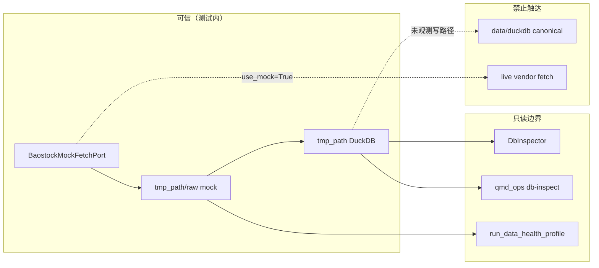

# Audit A4 — 安全（R3-DCP-03 post-write inspect）

| 元信息   | 值                                                                 |
| -------- | ------------------------------------------------------------------ |
| 维度     | A4 安全（`agents/security-auditor.md` · `security-and-hardening`） |
| 任务     | `06-30-wave3-r3-dcp-03-post-write-inspect`                         |
| 协议     | v4.1 · `AUDIT.plan.md` A4 行                                       |
| Worktree | `C:\Users\Guang\Desktop\quant-monitor-desk-wt-dcp03`               |
| 审计日期 | 2026-06-30                                                         |
| 模型     | security-auditor subagent                                          |

---

## 维度证据

### AUDIT.plan A4 检查矩阵（独立读码 + pytest）

| 检查项                         | 结果     | 证据                                                                                                                                                                                                 |
| ------------------------------ | -------- | ---------------------------------------------------------------------------------------------------------------------------------------------------------------------------------------------------- |
| **隔离库 `tmp_path`**          | **PASS** | `post_write_inspect_support.py` L25–30 `bootstrap_db(tmp_path)` → `tmp_path/post_write_incr.duckdb`；三测均 `tmp_path` fixture；`raw_root = tmp_path / "raw"`                                       |
| **禁止 canonical `data/duckdb/` 写** | **PASS** | `rg 'data/duckdb\|quant_monitor\.duckdb' tests/post_write_inspect_support.py tests/test_incremental_post_write_inspect.py` → 0；CLI 测显式 `--db`/`--data-root` 指向 `cm.db_path`/`raw_root`（L119–126），不触发 `qmd_ops._default_db_path()` |
| **inspect 无自由 SQL 注入**    | **PASS** | 测试 SQL 均参数化：`seed_watermark_row` L34–42 `?`；`test_incremental_post_write_inspect.py` L76–78 `WHERE instrument_id = ?`；`build_evidence_bundle_from_fetch_log` L145–152 静态 SELECT；`DbInspector` 表名来自 contract + `quote_ident`（`db_inspector.py` L281–282），本切片未向 inspect 注入用户可控 SQL 片段 |
| **无 live fetch 副作用**       | **PASS** | `build_service` L48 `create_baostock_fetch_port(..., use_mock=True)`；mock 分支 `BaostockMockFetchPort`（`baostock_port.py` L155–156）不经 `gate_live_fetch_port`；health 断言 `production_db_mutated is False`（L105） |

### 点名深审（用户 scope）

#### 1. `post_write_inspect_support.py` SQL 参数化

| 位置 | 模式 | 判定 |
| ---- | ---- | ---- |
| L34 `DELETE ... instrument_id = ?` | 绑定 `[SYMBOL]` | PASS |
| L35–42 `INSERT ... VALUES (?, ?, ...)` | 绑定 `[SYMBOL, trade_date]` | PASS |
| L145–152 `SELECT ... FROM fetch_log WHERE status = 'SUCCESS'...` | 无外部拼接 | PASS |
| L76–78（test 文件）`MAX(trade_date) ... instrument_id = ?` | 绑定 `[SYMBOL]` | PASS |

#### 2. `build_evidence_bundle_from_fetch_log` 路径遍历

| 步骤 | 行为 | 对照 |
| ---- | ---- | ---- |
| L157–159 | 从 `fetch_log.raw_file_paths` 解析绝对路径列表 | 生产 `staged_evidence._resolve_under_data_root`（`staged_evidence.py` L30–38）有 `data_root`  containment |
| L165–170 | `src = Path(raw_path)` → `shutil.copy2(src, bundle_dir/rel_name)` | **未**校验 `src` 是否在 `raw_root`/`tmp_path` 下 |
| L173–180 manifest | 写入 `relative_paths: [raw_0.json]` | 下游 `run_data_health_profile` → `_bars_from_evidence` → `_resolve_payload_path`（`data_health.py` L259–272）对 bundle 内相对路径有 containment |

**威胁评估：** 仅 `tests/` helper；正常流程下 `fetch_log` 由同会话 `DataSourceService` 写入 `tmp_path/raw`；需先污染隔离库 `fetch_log` 方能指向库外文件（测试作者可控环境，非生产攻击面）。复制目标文件名固定为 `raw_{idx}.json`，不向外写 canonical 路径。**判定：防御纵深缺口可记录，不构成本切片可利用漏洞（不进 findings 表）。**

#### 3. `ResourceGuard` monkeypatch 范围

| 机制 | 范围 | 判定 |
| ---- | ---- | ---- |
| `conftest.py` L113–122 autouse | 全仓测试（除 `test_resource_guard.py`/`test_foundation_smoke.py`）patch `ResourceGuard.check` → `(OK, "")` | 既有仓内约定 |
| `run_two_incremental` L79 · `test_postWriteInspect` L48 | 重复 patch 同类方法 | 冗余、不扩大攻击面；`monkeypatch` 用例级自动回滚 |
| 未 patch | `snapshot`/`HARD_STOP` 路径 | 本切片不测 guard 负向，合理 |

#### 4. CLI 子进程参数

```python
# test_incremental_post_write_inspect.py L36–38
cmd = [sys.executable, str(_PROJECT_ROOT / "scripts" / "qmd_ops.py"), "db-inspect", *args]
subprocess.run(cmd, capture_output=True, text=True, check=False, cwd=_PROJECT_ROOT)
```

| 向量 | 判定 | 证据 |
| ---- | ---- | ---- |
| Shell 注入 | PASS | 列表 argv、**无** `shell=True` |
| 默认 canonical 读 | PASS | 调用 L119–126 必传 `--db`/`--data-root` 绝对路径 |
| 子进程写副作用 | PASS | `qmd_ops db-inspect` 只调 `DbInspector.inspect()`（读）；未传 `--output` |
| 路径注入经 CLI | PASS | 参数来自 `tmp_path` 受控对象 `str(cm.db_path)`，非外部输入 |

### 信任边界（STRIDE 摘要）



### 独立 pytest

```text
cd quant-monitor-desk-wt-dcp03
uv run pytest tests/test_incremental_post_write_inspect.py -q
→ 3 passed (2026-06-30)
```

### GitNexus

| 动作 | 结果 |
| ---- | ---- |
| `query("build_evidence_bundle_from_fetch_log post_write_inspect DbInspector")` | 命中 `DbInspector.inspect` · `qmd_ops.main`；**未索引** 新测文件（未 commit，预期） |
| 判定 | 以源码 + pytest 为准 |

### A4 checklist（security-auditor）

- [x] 范围 = 未跟踪新测 + `test_catalog.yaml` delta
- [x] 威胁面：隔离库 / SQL / 路径 / CLI 子进程 / live fetch
- [x] 发现附 `file:line` 或 rg
- [x] DOUBT 对抗搜索（见计划外声明）
- [x] 验证只信代码 + 跑测，不信文档自述

---

## §维度裁决

**PASS**

---

## 计划内问题

| ID  | P   | 标题 | 锚点 | 根因 | 修复方案 | 验证 |
| --- | --- | ---- | ---- | ---- | -------- | ---- |
| —   | —   | 无   | —    | —    | —        | —    |

---

## 计划外发现

| ID  | P   | 标题 | 锚点 | 根因 | 修复方案 | 验证 |
| --- | --- | ---- | ---- | ---- | -------- | ---- |
| —   | —   | 无   | —    | —    | —        | —    |

已对抗搜索：`fetch_log` 路径污染 / `../../` 逃逸（helper L165–170 vs `staged_evidence._resolve_under_data_root`）· CLI 缺省 canonical `--db` 误用 · `shell=True` 子进程 · `use_mock=False` 误配 · `ResourceGuard` 全局永久 patch（非 monkeypatch）· `DbInspector` 用户可控表名 SQL 拼接 · health profile DB 写路径 · 明文密钥/token in diff · `production_db_mutated` 误 true — 除「helper 绝对路径未 containment」为测试内可接受风险外，无可利用项。

**可选加固（非阻塞）：** 若 helper 复用到更广场景，可在 `build_evidence_bundle_from_fetch_log` 增加 `raw_root` 参数并 `is_relative_to` 校验后再 `copy2`（对齐 `staged_evidence.py` L30–38）。

---

## A4 关账 checklist

- [x] `agents/audit-finding-schema.md` 结构
- [x] AUDIT.plan A4 四项全 PASS
- [x] §维度裁决 ∈ {PASS}
- [x] findings 两表均为占位行
- [x] 报告已落盘 `research/audit-a4-report.md`
