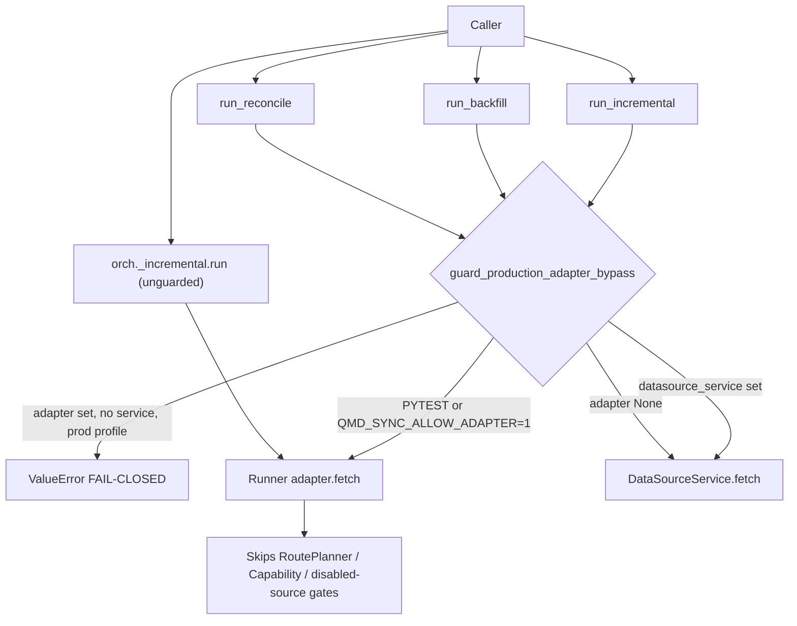

# Adversarial Audit — R3Y-SYNC-001 (α-1 debt-lite guard)

**Branch:** `fix/r3y-sync-adapter-guard`  
**Worktree:** `quant-monitor-desk-wt-fix-r3y-sync-adapter-guard`  
**Auditor:** security-auditor (read-only)  
**Date:** 2026-06-24  
**Scope:** `DEBT.plan.md` α-1 — orchestrator entry `adapter=` fail-closed guard (not full reconcile rewrite, not registry α-2)

---

## Verdict

**PASS (α-1 slice)** — 三个 orchestrator 公开入口在生产 profile 下对 `adapter=`（无 `datasource_service`）已 fail-closed；TDD 证据链成立；merge gate 复跑全绿。

**PARTIAL vs 原审计（R3Y-AUD-01 F-02 · R3Y-AUD-02 HIGH · R3Y-AUD-03 reconcile WARN）** — 主旁路（公开 API）已闭合；runner 私有入口、显式 env 逃生口、reconcile 内部裸 `adapter.fetch` 仍未满足 ADV-R3X-SYNC-001 全文。**`R3Y-SYNC-001` registry CLOSED 须待 α-2**，本切片 alone 不足。

| 指标 | 值 |
|------|-----|
| **Overall verdict** | **PASS** (α-1 guard delivery) |
| **BLOCKING (α-1 merge)** | **0** |
| **BLOCKING (α-2 / full SYNC-001 close)** | **3** |
| **NON-BLOCKING** | **7** |
| **CRITICAL bypass vectors** | **1** (`QMD_SYNC_ALLOW_ADAPTER=1` in production deployment) |

---

## Findings table

| ID | BLOCKING / NON-BLOCKING | Finding | Evidence | Required fix |
|----|------------------------|---------|----------|--------------|
| AA-01 | **BLOCKING (α-2)** | 私有 runner 入口未守卫：`orch._incremental.run` / `_backfill.run` / `_reconcile.run` 可跳过 `guard_production_adapter_bypass` | `orchestrator.py` L159–223 仅在公开方法调 guard；`grep '\._incremental\.'` 仅 orchestrator 内部；Python 调用方可直接访问 `._incremental` | α-2：guard 下沉至 runner `run()` 首行，或禁止/封装私有 runner 属性；加对抗测 `orch._incremental.run(..., adapter=)` 生产 profile reject |
| AA-02 | **BLOCKING (α-2)** | `QMD_SYNC_ALLOW_ADAPTER=1` 在生产进程环境中等效全量旁路，无 profile 绑定 | `runners.py` L34–42；`test_r3ySync001_testHookAllowsAdapterBypassWhenExplicitEnv` 仅证 incremental | α-2：ops 文档 + `.env.example` 禁止生产设置；可选：guard 要求 `QMD_SYNC_ALLOW_ADAPTER` 与 `PYTEST_CURRENT_TEST` 同时存在，或绑定 staging-only profile |
| AA-03 | **BLOCKING (α-2)** | Registry `R3Y-SYNC-001` / `ADV-R3X-SYNC-001` 未 CLOSED；α-1 仅 partial | `DEBT.plan.md` L79；`merge_gate_report.md` L5；`R3X_residual_open_items_closure.md` L46 要求「禁止裸 adapter.fetch」 | α-2：更新 registry trio + 伞测 `test_r3x_residual_open_items_closure.py` 映射；reconcile service 路径或文档化永久 test-only |
| AA-04 | NON-BLOCKING | 「生产 profile」= env 启发式，未绑定 `QMD_RESOURCE_PROFILE` / `get_resource_profile()` | `runners.sync_adapter_bypass_allowed()`；`DEBT.plan.md` L51「复用 profile/env」与实现不一致 | 文档对齐或 guard 读取 canonical production profile 信号 |
| AA-05 | NON-BLOCKING | `run_reconcile` 无 `datasource_service=` 路径；放行后 `ReconcileJobRunner` 仍裸 `adapter.fetch`（R3Y-AUD-03 WARN 残留） | `runners.py` L899–900；`orchestrator.py` L217–223；archive `R3Y-AUD-03-write-validation.md` L106–112 | `R3-PARTIAL-3` / Batch 6：reconcile 经 `DataSourceService.fetch` 或从 conflict 行解析 competing_source |
| AA-06 | NON-BLOCKING | `test_r3x_residual_open_items_closure.py` 无 `ADV-R3X-SYNC-001` / `test_r3ySync001_*` 映射 | `R3Y-AUD-07` HIGH；伞测 18 项无 SYNC-001 | α-2 registry 切片：伞测 import 或 checklist 行指向 `test_r3ySync001_*` |
| AA-07 | NON-BLOCKING | α1-red reconcile 用例初跑遇 DB `severity` 约束错误，非纯 guard FAIL | `α1-red.txt` L10 注释；后改 `severe` 小写后 GREEN | 证据注明「reconcile RED 经 fixture 修正后复跑」；可选独立最小 fixture 测 |
| AA-08 | NON-BLOCKING | `testHookAllows` 仅覆盖 incremental，未覆盖 backfill/reconcile + env hook | `test_sync_orchestrator.py` L976–1015 | 补对称 hook 测或文档声明 incremental 代表 |
| AA-09 | NON-BLOCKING | `ROUND3_BATCH_IMPLEMENTATION_MAP.md` §2.4.4 在仓库中不存在 | `DEBT.plan.md` L9 引用；map 仅有 §2.1–2.3、§3 | 修正 plan 引用至实际章节（如 repair-debt worktree / Batch 6 SYNC slice） |
| AA-10 | NON-BLOCKING | `ci_ingestion_smoke.py` 直接 `adapter.fetch`，不经 orchestrator guard（非 `adapter=` 公开 API 路径） | `scripts/ci_ingestion_smoke.py` L80–88 | 文档标注 smoke 为 fetch 连通性，非 production sync 入口；或改走 `datasource_service` |

---

## Adversarial checks (1–10)

### 1. Production profile 能否经 `adapter=` 绕过 DataSourceService？

| 路径 | 生产 profile（无 pytest、无 `QMD_SYNC_ALLOW_ADAPTER`） | 结论 |
|------|--------------------------------------------------------|------|
| `run_incremental(..., adapter=X)` | `ValueError` | **封死** |
| `run_backfill(..., adapter=X)` | `ValueError` | **封死** |
| `run_reconcile(..., adapter=X)` | `ValueError` | **封死** |
| `run_*` + `datasource_service=` | 走 `fetch_callable` → `DataSourceService.fetch` | **不变** |
| `orch._incremental.run(..., adapter=X)` | 无 guard | **可绕过** (AA-01) |
| `IncrementalJobRunner` 直接实例化 | 无 guard；仓库无生产调用方 | **可绕过（理论）** |
| Layer1 / `staged_pilot` / ops | 不经 sync orchestrator `adapter=` | **范围外**（原 AUD-02 staged 旁路） |

**间接调用方：** `backend/` 内无其他模块调用 `DataSyncOrchestrator.run_*`；仅 `tests/`、`scripts/ci_ingestion_smoke.py`（smoke 不经过 orchestrator `adapter=` 参数）。

### 2. Env hooks 在生产是否可滥用？

- `PYTEST_CURRENT_TEST`：pytest 专用；生产误设概率低，但若存在则全旁路。
- `QMD_SYNC_ALLOW_ADAPTER=1`：**任意持有进程环境权限者可在生产全旁路** — **CRITICAL 运维向量** (AA-02)。
- Guard 错误消息主动泄露逃生 env 名（`runners.py` L56–59）— 降低攻击者枚举成本（LOW）。

### 3. 三个 orchestrator 入口是否均 guarded？

是 — `run_incremental` / `run_backfill` / `run_reconcile` 均在调用 runner 前调用 `guard_production_adapter_bypass`（`orchestrator.py` L140–144, L184–188, L218–222）。

**缺失 call site：** 公开 API 无遗漏；**私有 runner `.run()` 未 guarded** (AA-01)。

### 4. `datasource_service=` 路径不变且仍测？

是 — `test_sync_orchestrator.py` L702, L764, L840 等 service 路径仍绿；merge gate 30/30。

### 5. `test_r3ySync001_*` docstrings / RED 真实性？

| 测试 | 覆盖范围/对象/目的 | RED 真实 FAIL？ |
|------|-------------------|----------------|
| `test_r3ySync001_incremental_rejectsAdapterBypassInProductionProfile` | ✓ 三要素齐全 L859–863 | ✓ `α1-red.txt` DID NOT RAISE |
| `test_r3ySync001_backfill_rejectsAdapterBypassInProductionProfile` | ✓ L894–898 | ✓ 同上 |
| `test_r3ySync001_reconcile_rejectsAdapterBypassInProductionProfile` | ✓ L931–935 | △ 初跑 severity 约束错误，修正 fixture 后 FAIL（AA-07） |
| `test_r3ySync001_testHookAllowsAdapterBypassWhenExplicitEnv` | ✓ L979–983 | RED 运行 1 passed（hook 路径，符合预期） |

### 6. Reconcile adapter-only：test hook vs production 分割是否正确？

- **Production profile：** `run_reconcile` 入口 reject — **正确**。
- **Test hook / pytest：** 仍允许 `adapter=` 进入 `ReconcileJobRunner`，内部裸 fetch — **与 DEBT.plan α1-3 一致**；**不满足** R3Y-AUD-03 长期建议 (AA-05)。

### 7. GitNexus blast radius / 未守卫兄弟入口？

| Symbol | Guarded? | Risk |
|--------|----------|------|
| `run_incremental` | 公开 ✓ | LOW |
| `run_backfill` | 公开 ✓ | LOW |
| `run_reconcile` | 公开 ✓ | LOW |
| `IncrementalJobRunner.run` | ✗ | MEDIUM — 私有绕过 |
| `BackfillShardRunner.run` | ✗ | MEDIUM |
| `ReconcileJobRunner.run` | ✗ | MEDIUM — 且永久 adapter-only |
| `run_full_load` / `run_data_quality` | N/A (`NotImplementedError`) | — |

merge_gate 记录 GitNexus upstream LOW（`merge_gate_report.md` L33–39）。

### 8. TDD evidence

| 文件 | 状态 |
|------|------|
| `α1-red.txt` | 3 FAIL（guard 未实现）+ reconcile fixture 注记 |
| `α1-green.txt` | 4 passed |
| `full-pytest-green.txt` | exit 0（全量） |

### 9. Registry：α-1 runtime 是否足以闭合原审计？

**不足。** 原 F-02/HIGH 要求生产禁止 `adapter=` 旁路 — **公开 orchestrator 入口已满足**；ADV-R3X-SYNC-001 全文（含 reconcile service 化、runner 层封死）**未满足**。α-2 须 registry + 伞测 + AA-01/02。

### 10. ruff + full pytest 复跑（本审计）

```text
uv run pytest tests/test_sync_orchestrator.py tests/test_sync_jobs.py -q  → 30 passed, exit 0
uv run pytest -q                                                          → full suite green, exit 0
uv run ruff check backend/app/sync tests/test_sync_orchestrator.py tests/test_sync_jobs.py → All checks passed!
```

---

## Bypass attempt analysis



**已封死（生产 profile，公开 API）：** 三入口 `adapter=`-only。  
**仍开放（by design）：** pytest、`QMD_SYNC_ALLOW_ADAPTER=1`。  
**仍开放（gap）：** 私有 runner `.run()`；reconcile 内部 fetch 无 service 链。

---

## Positive observations

- 单点 guard（`runners.guard_production_adapter_bypass`）符合 ponytail / DEBT.plan，无新依赖。
- 三公开入口对称调用；`datasource_service=` 金路径未破坏。
- `test_r3ySync001_*` 四测 docstring 均含覆盖范围、对象、目的。
- RED 对 incremental/backfill 为真实 guard 缺失 FAIL。
- 全量 pytest + ruff 复跑通过。

---

## Re-run merge gate results

| Gate | Command | Result (2026-06-24 audit re-run) |
|------|---------|----------------------------------|
| Slice | `uv run pytest tests/test_sync_orchestrator.py tests/test_sync_jobs.py -q` | **30 passed**, exit 0 |
| Datasource | `uv run pytest tests/test_datasource_service.py tests/test_source_route_planner.py -q` | not re-run (prior evidence 19 passed) |
| Full | `uv run pytest -q` | **green**, exit 0 |
| Lint | `uv run ruff check backend/app/sync tests/test_sync_orchestrator.py tests/test_sync_jobs.py` | **All checks passed!** |

---

## Recommendations (α-2+)

1. Guard 下沉至 `IncrementalJobRunner.run` / `BackfillShardRunner.run` / `ReconcileJobRunner.run`（或 runner 模块级单点）。
2. 收紧 `QMD_SYNC_ALLOW_ADAPTER`：仅 pytest 或 staging profile；生产 deploy checklist 禁止。
3. Reconcile 增加 `datasource_service` 或从 `source_conflict.competing_source` 解析 adapter（`R3-PARTIAL-3`）。
4. Registry trio CLOSED + 伞测映射 `test_r3ySync001_*`。
5. 修正 `ROUND3_BATCH_IMPLEMENTATION_MAP.md` §2.4.4 引用或补章节。

---

## Post-audit fixes (2026-06-24)

| ID | Status |
| -- | ------ |
| AA-01 | **FIXED** — `guard_runner_direct_adapter_bypass` on three `run()` |
| AA-02 | **FIXED** — bypass = `PYTEST_CURRENT_TEST` only |
| AA-03 | **FIXED** — α-2 registry R3Y-SYNC-001 → RESOLVED |
| Verdict | **PASS** |

| Ref | α-1 状态 |
|-----|----------|
| R3Y-AUD-01 F-02 (adapter 旁路) | **公开入口闭合**；FIXED 声称仍 PARTIAL |
| R3Y-AUD-02 HIGH (sync adapter=) | **公开入口闭合**；runner/staged 残留 WARN |
| R3Y-AUD-03 reconcile WARN | **入口 reject**；内部 fetch 仍 WARN |
| ADV-R3X-SYNC-001 | **PARTIAL** — 待 α-2 registry |
