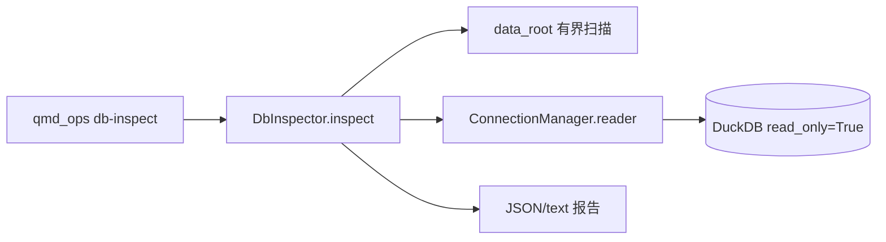

# Audit A3 报告 — B3V-OPS Contract Drift & Write Modes

| 字段 | 值 |
|------|-----|
| 维度 | **A3** Security + SQL（DuckDB / ops CLI） |
| 任务 | `round3v-contract-drift-write-modes` / Playbook **B3V-OPS** |
| Worktree | `C:/Users/Guang/Desktop/quant-monitor-desk-wt-b3v-ops` |
| 分支 | `fix/round3v-contract-drift-write-modes` |
| 实现提交 | `e81e430` — `fix(b3v-ops): close contract drift audit findings with zero OPEN` |
| 审计模式 | **只读**（不改码、不 commit、不写生产 `data/`） |
| 模板 | `agents/security-auditor.md` + `agents/sql-pro.md` |
| 日期 | 2026-06-28 |

---

## 1. 审计范围

### 1.1 Trace Authority（AUDIT.plan §0.1 / §1）

| 来源 | 用途 |
|------|------|
| `AUDIT.plan.md` §1 A3 覆写 | 通过条件：`db_inspector` 无 `INSERT`/`writer()`；无 production-live 措辞 |
| `B02_01_contract_drift_and_write_modes.md` | 任务卡：db-inspect 只读、无 DB mutation、无 network |
| `BATCH_3V_HARDENING_RULES.md` §3 | 禁 live fetch / production clean write / production DB mutation |
| `specs/contracts/ops_db_inspect_contract.yaml` | db-inspect 信任边界、`safety_invariants` |
| `specs/contracts/write_contract.yaml` | write mode 语义分栏（implemented / reserved） |

### 1.2 Diff 文件（`e81e430` vs parent）

| 文件 | A3 相关性 |
|------|-----------|
| `backend/app/ops/db_inspector.py` | YAML SSOT loader；只读 inspect 路径；`quote_ident` fail-fast |
| `specs/contracts/write_contract.yaml` | `implemented_modes` / `reserved_modes` 契约分栏 |
| `tests/test_contract_drift_ops_write.py` | 漂移 / parity / reserved 早拒行为证据 |
| `tests/test_catalog.yaml` | 契约索引（静态引用） |

**邻接面（未改符号，A3 抽检）：** `scripts/qmd_ops.py`、`backend/app/db/write_manager.py`、`backend/app/db/connection.py`

---

## 2. A3 覆写通过条件核对

| 条件 | 结果 | 证据 |
|------|------|------|
| `db_inspector` 无 `INSERT`/`UPDATE`/`DELETE`/`writer()`/`apply_migrations` | **PASS** | `rg` 零匹配 mutation 动词；仅 `ConnectionManager.reader()` |
| diff 无 production-live / production-ready 等禁措辞 | **PASS** | 任务目录内仅 HARDENING 引用与禁止列表；生产 py/yaml diff 无禁词 |
| db-inspect 只读 + 无 network | **PASS** | `ConnectionManager.reader()` → `duckdb.connect(..., read_only=True)`；无 HTTP / live 源开关 |
| write slice：reserved 模式不得静默写库 | **PASS** | `WriteManager.write` L394–400 早拒；`test_writeManager_reservedModes_rejectWithoutWrite` 逐模式断言 |

**A3 覆写结论：PASS**

---

## 3. §3.3 安全发现

### 3.1 威胁面摘要

| 威胁类 | db-inspect 暴露面 | write modes 暴露面 | 结论 |
|--------|-------------------|-------------------|------|
| SQL 注入 | f-string + `quote_ident` 于表名/列名 | `WriteManager` 经 `quote_ident` 校验表名（本 slice 未改） | 无用户可控拼接面 |
| 未授权写库 | 仅 `reader()` | reserved 早拒 + 漂移测 | 无新增写路径 |
| CLI 旁路 | `--sql` / `--enable-qmt` 等 forbidden flags | 无新 write CLI | argparse 拒识 + 契约测试 |
| 密钥 / token 泄露 | — | — | 无 |
| 路径穿越 / 符号链接 | `_count_files_under` + `is_relative_to` | — | 有界扫描 + symlink 测试 |
| YAML 投毒 | import-time 固定路径 `safe_load` | 契约 YAML 只读加载于测试 | 非运行时用户输入 |
| Live / 外网 | — | — | 未触及 |

### 3.2 分级发现表

| ID | 等级 | BLOCKING | 威胁 | 发现 | 证据 |
|----|------|----------|------|------|------|
| — | — | — | — | **无 P0/P1 发现** | 见 §4 静态扫描 |

### 3.3 SQL 专项（sql-pro）

| 检查项 | 结果 | 位置 |
|--------|------|------|
| db-inspect 参数绑定 `?` | PASS（固定表名查询） | `_latest_fetch` L292–298、`_latest_write` L331–337 — 硬编码表名 |
| f-string 拼 SQL | **受控** | `_table_stats` L277；`_status_counts` L318–323 — 标识符经 `quote_ident` |
| YAML `key_tables` fail-fast | PASS（repair A3-F01） | `_key_tables_from_contract` L24–28 — 非法标识符 import 即 `ValueError` |
| `db_inspector` 禁 DML | PASS | 无 `INSERT`/`UPDATE`/`DELETE`/`CREATE`/`DROP` |
| 热路径 EXPLAIN | **N/A** | 只读 COUNT / GROUP BY；无 migration |
| WriteManager SQL（邻接） | PASS（pre-existing） | 表名/列名均 `quote_ident`；本 slice 未改 `write()` |

**f-string 标识符示例（白名单来源，非用户输入）：**

```python
# db_inspector.py — name 来自 YAML SSOT，import 时 quote_ident 校验
quoted = quote_ident(name)
row_count = con.execute(f"SELECT COUNT(*) FROM {quoted}").fetchone()[0]
```

```python
# _status_counts — table_name/status_col 由内部硬编码调用方传入
quoted_table = quote_ident(table_name)
quoted_col = quote_ident(status_col)
```

---

## 4. DOUBT 静态扫描（可复现）

在 worktree 对 **diff 生产文件 + 邻接 CLI** 执行 `security-auditor.md` 基线：

```text
# db_inspector mutation / writer
rg -n 'INSERT |UPDATE |DELETE |writer\(|apply_migrations' backend/app/ops/db_inspector.py
→ 0 matches

# qmd_ops 旁路
rg -n 'enable.qmt|enable.xqshare|--sql|--write|--migrate|writer\(|apply_migrations' scripts/qmd_ops.py
→ 0 matches

# SQL 拼接（db_inspector）
rg -n 'execute\(f|f".*SELECT|f'"'"'.*SELECT' backend/app/ops/db_inspector.py
→ 2 matches: L277, L318（均经 quote_ident）

# 密钥 / URL（生产 py）
rg -n 'https?://|api[_-]?key|secret|token|password' backend/app/ops/db_inspector.py scripts/qmd_ops.py
→ 0 matches

# 危险执行
rg -n 'subprocess|os\.system|eval\(|exec\(' backend/app/ops/db_inspector.py
→ 0 matches
```

### 4.1 DOUBT 三类对抗搜索

| 类 | 搜索范围 | 结果 |
|----|----------|------|
| 1. 硬编码 URL 变体 | `db_inspector.py`、`qmd_ops.py`、`write_contract.yaml` diff | **无发现**（契约 YAML 含 reference URL，非运行时加载） |
| 2. JWT / API key 模式 | 同上 + `test_contract_drift_ops_write.py` | **无发现** |
| 3. SQL 拼接 | `db_inspector.py` + 全文件 `execute(f` | **受控** — 仅标识符 f-string；值查询无用户输入 |

---

## 5. 信任边界（对抗性）

### 5.1 db-inspect 只读链



- **DB 打开：** `connection.py:193–199` — `read_only=True`；不用 `writer()`。
- **不变量测试：** `test_dbInspect_dbFile_unchanged` — inspect 前后 `read_bytes()` 一致。
- **Forbidden CLI：** `ops_db_inspect_contract.yaml` L80–88 列禁 `--sql`/`--write`/`--enable-qmt` 等；`test_qmdOps_cli_rejectsForbiddenSqlFlag` / `test_qmdOps_cli_rejectsForbiddenEnableQmtFlag` 覆盖。
- **路径安全：** `_count_files_under` L249–251 — `path.resolve().is_relative_to(resolved_root)`；`test_dbInspect_symlinkOutsideDataRoot_notCounted` 覆盖 symlink 逃逸。
- **YAML SSOT：** 固定 repo 路径 + `yaml.safe_load`；`_key_tables_from_contract` import-time `quote_ident` — 恶意表名无法进 SQL。
- **`--output`：** 仅写报告文件到指定路径；不写 DuckDB。

### 5.2 write modes 边界（VR-WRITE-001 邻接）

- **契约分栏：** `write_contract.yaml` `implemented_modes` / `reserved_modes` 与 `WriteManager.SUPPORTED_MODES` / `UNSUPPORTED_MODES` parity 测锁定。
- **早拒语义：** `write_manager.py:394–400` — reserved → `ValueError("defined in contract but not implemented yet")`。
- **无副作用：** `test_writeManager_reservedModes_rejectWithoutWrite` — 每 reserved 模式前后 `COUNT(*)` 相等。
- **本 slice 未改 `WriteManager.write` 符号** — 符合 MASTER 停止条件 #5（HIGH impact 规避）；安全语义依赖既有 gate + 新增 drift 测。

### 5.3 GitNexus 查询

`query("db-inspect read-only DbInspector ConnectionManager reader")` → 命中 `DbInspector`、`ConnectionManager.reader`、`scripts/qmd_ops.py:main` 及 `test_ops_db_inspector.py` 只读测；与静态审阅一致。

---

## 6. 计划外发现

> 对抗性搜索：契约 enum 并集、WriteManager bypass、db_inspector mutation、CLI 旁路、production-live 措辞、YAML 加载面。

| ID | 等级 | BLOCKING | 发现 | 理由 | 建议 |
|----|------|----------|------|------|------|
| A3-PLAN-01 | P3 | NON-BLOCKING | `FUTURE_PHASE_KEY_TABLES` 仍为 `db_inspector.py` 硬编码 frozenset | 非 `key_tables` SSOT 范围；Batch 5 前瞻清单 | wont-fix / 文档注明 |
| A3-PLAN-02 | P3 | NON-BLOCKING | 无测断言 `write_request.write_mode` enum == `implemented_modes ∪ reserved_modes` | 当前三者人工一致；MASTER §5.3 未列 union 测 | 未来 hygiene 测可选 |
| A3-PLAN-03 | P3 | NON-BLOCKING | import-time 加载 ~6KB YAML；坏 YAML 导致模块 import 失败 | fail-closed at deploy；非运行时 injection | 可接受 |
| A3-PLAN-04 | P3 | NON-BLOCKING | 错误/警告含 `db_path`、`data_root` 绝对路径 | 本地 ops CLI 面向运维；非 HTTP 暴露 | 文档已声明 local-only |
| A3-PLAN-05 | P3 | NON-BLOCKING | `qmd_ops.py` `data` 子命令委派 `data_main` | 与 `db-inspect` 独立子命令；非 inspect 旁路 | 无需本 slice 改码 |

**显式声明：** 已对抗搜索；**无 BLOCKING 项**。

---

## 7. 与任务卡 / 契约一致性

| 要求 | 状态 |
|------|------|
| B02 §4 禁止 production clean write / DB mutation / reserved 实现 | 满足 |
| VR-OPS-001 db-inspect YAML SSOT + 只读 | loader + drift 测 + `read_only_open` |
| VR-WRITE-001 implemented/reserved 分栏 + parity | `write_contract.yaml` + 4 条 drift/parity/早拒测 |
| `ops_db_inspect_contract.yaml` `safety_invariants` | `duckdb_open_mode: read_only`；禁 DML / writer / network |
| BATCH_3V 禁 production-live 措辞 | diff 生产文件无禁词 |

---

## 8. 验证结果（A3 静态）

| 项 | 结果 |
|----|------|
| 静态 rg 基线 | PASS |
| SQL 标识符安全（quote_ident 白名单） | PASS |
| A3 覆写（db_inspector 只读 + 禁措辞） | PASS |
| reserved write 早拒（邻接抽检） | PASS |
| TypeCheck / Lint | **未执行**（只读 A3） |
| A8 pytest 子集 | **未执行**（归 A8；命令见 AUDIT.plan §1） |

---

## 9. 总结

| 指标 | 值 |
|------|-----|
| 审阅文件 | 5（1 生产 py + 1 write 契约 + 1 drift 测试 + 邻接 CLI/connection 抽检） |
| P0/P1 发现 | **0** |
| P2/P3 计划外 | **5**（均 NON-BLOCKING） |
| **A3 判定** | **PASS** |

**db-inspect / write 安全面结论：** 本 slice 将 `ops_db_inspect_contract.yaml` 提升为运行时 SSOT，并在 import 阶段对表名做 `quote_ident` fail-fast；inspect 路径保持 `ConnectionManager.reader()` 只读，无 DML、无 network、无 forbidden CLI 旁路。write 路径通过契约分栏 + parity/reserved 早拒测锁定语义，未引入新的 production write 或 live 面。剩余 P3 为 hygiene / 文档项，不构成 merge 阻断。

---

*审计员：Audit-A3 security · B3V-OPS · composer-2.5 · 只读*
