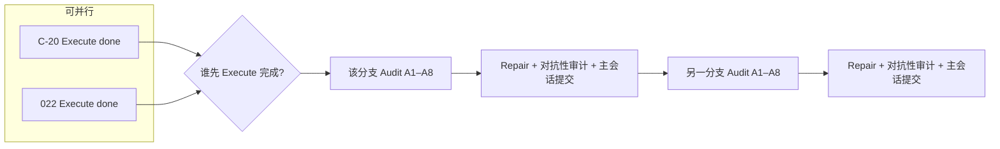

# Wave C 主会话协调手册

> **性质：** 主会话（merge coordinator）的一次性操作剧本，**不替代** `ROUND3_BATCH_IMPLEMENTATION_MAP.md` §2.2 的 worktree/allowed/forbidden SSOT。  
> **适用：** Wave C 四路并行 — **C-20（PROMPT_20）** ∥ **022** ∥ **fix α-3** ∥ **fix β-2**。  
> **基线：** `master` @ `c6d52f0b` 起（含 Wave B 归档）；**本 playbook 须已提交后再开 worktree**。

---

## 1. 这份文件是什么

桌面 `流程—临时文件.txt` 的**结构化重写版**：规定主会话如何**派发 agent、串并行门禁、验收与提交**，避免四路并行时审计/修复/合并互相踩踏。

| 角色         | 职责                                                                                                                 |
| ------------ | -------------------------------------------------------------------------------------------------------------------- |
| **主会话**   | 开 worktree、按本手册派发子 agent、跑全量测试、收尾提交、按 MAP 合并顺序合入                                         |
| **子 agent** | 在**单一分支 + 单一核心文件组**内完成 Plan / 质检 / Execute / Audit / Repair；**模型固定 `composer-2.5`**（见 §2.4） |
| **权威边界** | 分支名、路径、allowed/forbidden → `ROUND3_BATCH_IMPLEMENTATION_MAP.md` §2.2                                          |
| **权威输入** | 任务卡 + **`docs/` 设计文档 + `specs/` 契约/规则** → **§3**（不得只读任务卡）                                        |

---

## 2. 全局铁律（所有分支、所有阶段）

### 2.1 闭环原则

- **阻塞项与非阻塞项一律修完** — 审计/对抗性检查列出的每一项都必须有修复或经主会话书面记录的 defer（含 owner、phase、closure test）。
- **不得扩大范围与边界** — 仅改 MAP §2.2 允许的 slice；registry 三件套由主会话**单独批处理**，禁止四路 agent 并发改。

### 2.2 实现与测试

| 规则                 | 要求                                                                                                                                                   |
| -------------------- | ------------------------------------------------------------------------------------------------------------------------------------------------------ |
| **TDD**              | 正式代码：**先 RED（必须失败）→ 再 GREEN**；见 `.cursor/skills/trellis-execute` 与 `testing-guidelines`                                                |
| **Ponytail（生产）** | `backend/`、`scripts/` 等正式实现路径严格遵守 ponytail                                                                                                 |
| **Ponytail（测试）** | **`tests/` 下新增/修改的测试代码（含 fixture、helper、parametrize 数据）同样严格遵守 ponytail** — 见 §2.2.2                                            |
| **测试注释**         | 每个新增/修改的 `test_*` docstring **必填五字段**（见 §2.2.1）；细则：`testing-guidelines` §9.1 · `docs/quality/ROUND3_TEST_DOCSTRING_HYGIENE_PLAN.md` |
| **全量测试**         | 任意代码修复后必须 `uv run pytest -q` 全绿                                                                                                             |
| **测试目的**         | 可改测试实现，**不得改测试目的/目标**（五字段中的「目的/目标」语义不可削弱）                                                                           |

#### 2.2.1 测试 docstring 五字段（模板）

与 `tests/test_layer3_snapshot_builder.py` 金样及 A8 门禁对齐；**目的/目标**与**失败含义**须通俗中文（非工程师可读）。

| 字段          | 要求                                                          |
| ------------- | ------------------------------------------------------------- |
| **覆盖范围**  | 场景人话（成功/失败路径、边界、分阶段约束等）                 |
| **测试对象**  | 被测符号、模块或文件路径                                      |
| **目的/目标** | 本测要证明什么（通俗中文；可引用 AC，但不可仅用编号代替人话） |
| **验证点**    | 具体断言、异常或产出（技术名可写在此）                        |
| **失败含义**  | 若本测变红，业务上失去什么保障                                |

#### 2.2.2 测试代码 ponytail（与生产同标准）

**范围：** `tests/**/*.py` 内一切非 docstring 代码 — `test_*`、fixture、`@pytest.fixture`、本地 helper、合成数据构造。

| 要求            | 说明                                                                                                             |
| --------------- | ---------------------------------------------------------------------------------------------------------------- |
| **先找已有**    | 优先复用 `conftest.py`、`tests/contract_gate_support.py`、同模块已有 fixture；禁止为单测复制一套 production 逻辑 |
| **最小 diff**   | 不新增「只为好看」的 wrapper/fixture 层；能内联断言的不拆三层 helper                                             |
| **无新依赖**    | 不为测试引入任务未批准的新包；stdlib + 项目已有 pytest 生态为准                                                  |
| **脆化禁止**    | 不断言 private 方法调用次数/顺序（`testing-guidelines` §2）；断言可观察业务结果                                  |
| **与 TDD 一致** | RED 测先写最简失败用例；GREEN 后若 fixture 膨胀，Execute 结束前须 ponytail 瘦身                                  |
| **审计**        | **A2（ponytail）** 与 **A8（QA）** 必须覆盖本分支 `tests/` 增量；Plan 质检须抽查测试 diff 是否违反上表           |

**不计入 ponytail 审查：** 五字段 docstring、中文注释、`# ponytail:` 标注的已知天花板说明。

### 2.3 Agent 模型约束

| 规则         | 要求                                                                                                                                  |
| ------------ | ------------------------------------------------------------------------------------------------------------------------------------- |
| **统一模型** | Wave C **所有**派发 agent（Plan / Plan 质检 / Execute / Audit A1–A8 / Repair / 对抗性审计 / debt-lite 修复）均使用 **`composer-2.5`** |
| **禁止**     | **`composer-2.5-fast`** 及任何未在主会话书面批准的其它 model slug                                                                     |
| **派发记录** | 主会话在派发时于任务 trace 或 merge gate 证据中注明 model=`composer-2.5`                                                              |

### 2.4 工具与 Skill（收尾必用）

| 时机             | 动作                                                                                                 |
| ---------------- | ---------------------------------------------------------------------------------------------------- |
| 编辑符号前       | GitNexus `impact()`                                                                                  |
| 提交前           | GitNexus `detect_changes()`；`uv run python scripts/loop_maintain.py`（docs/backend 触及时 `--fix`） |
| 复杂任务 Plan    | `trellis-plan` + `complex-task-planning-protocol.md`                                                 |
| 复杂任务 Execute | `trellis-execute` + 逐行读 `implement.jsonl`                                                         |
| 单分支 Done 提交 | 用户规则中的 commit 流程 + 全量 pytest 绿                                                            |
| 四路全部 Done    | 按 MAP §2.2 合并顺序合入 `master`                                                                    |

---

## 3. 权威必读索引（`docs/` · `specs/`）

> **意图：** 防止主会话/子 agent **只读任务卡或单一契约**而遗漏设计文档、规则与 registry。  
> **Plan 冻结要求：** Agent-1 必须把下表 **全部写入** `MASTER.plan.md` Source Context Index（或 `DEBT.plan.md`）；Agent-2 质检须 **逐路径核对** `implement.jsonl` 可索引、无遗漏。  
> **追溯规则：** 读完下表后，还须按 `MIGRATION_MAP.md`、`specs/context/authority_graph.yaml` 模块图 **向下追溯** imports/邻接模块；新发现的 `docs/`/`specs/` 路径 **补入计划**，不得口头「到时候再看」。

### 3.0 四路分支一览

| ID       | 轨道 | 分支                                     | Worktree（建议）                                     | Trellis 轨道  | 分支必读        |
| -------- | ---- | ---------------------------------------- | ---------------------------------------------------- | ------------- | --------------- |
| **C-20** | 正式 | `feature/round3-readonly-data-health-v1` | `../quant-monitor-desk-wt-r3-data-health`            | **complex**   | §3.1 + **§3.2** |
| **022**  | 正式 | `feature/round3-022-layer4-market`       | `../quant-monitor-desk-wt-022-layer4`                | **complex**   | §3.1 + **§3.3** |
| **α-3**  | 卫生 | `fix/r3y-prompt15-evidence`              | `../quant-monitor-desk-wt-fix-r3y-prompt15-evidence` | **debt-lite** | §3.1 + **§3.4** |
| **β-2**  | 卫生 | `fix/r3y-staged-registry-privatize`      | `../quant-monitor-desk-wt-fix-r3y-staged-reg`        | **debt-lite** | §3.1 + **§3.5** |

启动 Prompt：`ROUND3_BATCH_IMPLEMENTATION_MAP.md` §2.5 · 残留台账：`docs/quality/ROUND3_WAVE_B_PENDING_FIX_REGISTRY.md` · 边界 SSOT：MAP §2.2。

### 3.1 四路共用底座（每个分支 Plan 前必须 Read + 摘要）

| 类别         | 路径                                                          | 遵守什么                                  |
| ------------ | ------------------------------------------------------------- | ----------------------------------------- |
| **协调**     | `WAVE_C_MAIN_SESSION_COORDINATOR_PLAYBOOK.md`（本文件）       | Wave C 派发、PASS、模型、测试铁律         |
| **协调**     | `ROUND3_BATCH_IMPLEMENTATION_MAP.md` §2.2–§2.6                | worktree、allowed/forbidden、验证命令     |
| **协调**     | `.trellis/spec/guides/round3-repair-debt-worktree-plan.md` §6 | 一分支一核心文件组                        |
| **Registry** | `docs/AUDIT_DEFERRED_REGISTRY.md`                             | 开放/已关闭 ID；**本分支只读，勿并发改**  |
| **Registry** | `docs/UNRESOLVED_ISSUES_REGISTRY.md`                          | 操作面 OPEN 项                            |
| **Registry** | `docs/RESOLVED_ISSUES_REGISTRY.md`                            | 防重复打开                                |
| **Registry** | `docs/implementation_tasks/UNRESOLVED_ITEM_TASK_COVERAGE.md`  | ID → 任务/分支映射                        |
| **Handoff**  | `docs/ROUND3_HANDOFF.md`                                      | Round 3 入口与 staged-only 语境           |
| **质量门**   | `docs/quality/staged_acceptance_policy.md`                    | 分阶段验收                                |
| **质量门**   | `docs/quality/production_live_pilot_policy.md`                | Batch 2.75 / **不得声称 production-live** |
| **质量门**   | `docs/quality/BATCH3_STAGED_DOWNSTREAM_GATE.md`               | Batch 3 下游 staged 门禁（022 须遵守）    |
| **质量门**   | `docs/quality/ROUND3_TEST_DOCSTRING_HYGIENE_PLAN.md`          | 测试五字段                                |
| **全局规则** | `docs/implementation_tasks/GLOBAL_EXECUTION_RULES.md`         | 边界：docs/specs 非实现路径               |
| **全局规则** | `docs/implementation_tasks/GLOBAL_TESTING_POLICY.md`          | 语义测试                                  |
| **全局规则** | `docs/implementation_tasks/GLOBAL_RESOURCE_LIMITS.md`         | eco / ResourceGuard                       |
| **契约**     | `specs/contracts/runtime_versions.md`                         | 工具链与验证命令权威                      |
| **契约**     | `specs/contracts/write_contract.yaml`                         | 写路径合约                                |
| **契约**     | `specs/contracts/resource_limits.yaml`                        | 资源上限                                  |
| **契约**     | `specs/contracts/snapshot_lineage_contract.yaml`              | 快照血缘（022 及一切 snapshot）           |
| **架构**     | `docs/architecture/module_boundary_matrix.md`                 | 模块边界                                  |
| **索引**     | `MIGRATION_MAP.md`                                            | 实现目录与文档映射                        |

### 3.2 C-20 — 只读 Data Health（§3.1 + 本节）

**任务卡 / Prompt（Plan 第一读）**

| 路径                                                                                                     | 用途                              |
| -------------------------------------------------------------------------------------------------------- | --------------------------------- |
| `docs/implementation_tasks/ROUND_3_PARALLEL_PROMPTS/PROMPT_20_feature_round3_readonly_data_health_v1.md` | 分支启动、验证命令                |
| `docs/implementation_tasks/ROUND_3_ADVERSARIAL_AND_DATA_PILOT/R3Y_readonly_data_health_v1.md`            | AC、九切片、禁止项、报告 schema   |
| `docs/implementation_tasks/ROUND_3_ADVERSARIAL_AND_DATA_PILOT/R3Y_execution_discipline_addendum.md`      | TDD / ponytail / 全量 pytest 纪律 |

**`docs/` 设计文档**

| 路径                                                       | 用途                               |
| ---------------------------------------------------------- | ---------------------------------- |
| `docs/ops/data_health_cli.md`                              | CLI 行为与只读边界                 |
| `docs/ops/db_inspect_cli.md`                               | DB/数据根只读检查模式              |
| `docs/ops/verification_commands.md` § Round 3 gate hygiene | 合并审查 pytest 矩阵               |
| `docs/modules/data_validation_and_conflict.md`             | 校验与冲突语义                     |
| `docs/modules/duckdb_and_parquet.md`                       | 只读 DuckDB/Parquet 约定           |
| `docs/modules/write_manager.md`                            | **禁止绕过** WriteManager 写 clean |
| `docs/modules/data_sources.md`                             | source 角色与 disabled 默认        |
| `docs/modules/ops_and_performance.md`                      | ops 模块边界                       |
| `docs/quality/ROUND3_WAVE_B_PENDING_FIX_REGISTRY.md` §3    | `R3-B2.75-REQ2-EM` 等硬约束        |

**`specs/` 契约与注册表**

| 路径                                                 | 用途                           |
| ---------------------------------------------------- | ------------------------------ |
| `specs/contracts/data_quality_rules.yaml`            | rule_id、severity 语义         |
| `specs/contracts/source_conflict_rules.yaml`         | 冲突与 reconcile 规则          |
| `specs/contracts/ops_db_inspect_contract.yaml`       | 只读 inspect 合约              |
| `specs/contracts/source_route_contract.yaml`         | route / validation_only        |
| `specs/contracts/ops_health_check_contract.yaml`     | health 报告 envelope（若触及） |
| `specs/datasource_registry/source_registry.yaml`     | source 启用与角色              |
| `specs/datasource_registry/source_capabilities.yaml` | capability / validation_only   |

**前序证据（只读输入，Execute 须引用路径）**

| 路径                                                                                      | 用途                      |
| ----------------------------------------------------------------------------------------- | ------------------------- |
| `.trellis/tasks/archive/2026-06/06-24-round3-real-data-staged-pilot-v2/execute-evidence/` | PROMPT_19 v2 证据（优先） |
| `.trellis/tasks/archive/2026-06/feature-round3-real-data-staged-pilot/execute-evidence/`  | PROMPT_14 证据（回退）    |

**实现邻接（Execute 必读代码，不重复造轮子）**

`backend/app/ops/db_inspector.py` · `staged_pilot.py` · `mutation_proof.py` · `backend/app/db/validation_gate.py` · `backend/app/validators/` · `tests/test_ops_db_inspector.py` · `test_staged_pilot.py` · `test_data_quality_validator.py` · `test_source_conflict_validator.py` · `test_db_validation_gate.py` · `test_raw_store.py`

### 3.3 022 — Layer 4 市场结构（§3.1 + 本节）

**任务卡 / Prompt（Plan 第一读）**

| 路径                                                                                                | 用途                      |
| --------------------------------------------------------------------------------------------------- | ------------------------- |
| `docs/implementation_tasks/ROUND_3_MODELING_LAYERS/022_implement_layer4_market_structure.md`        | AC、验收命令、lineage §15 |
| `docs/implementation_tasks/ROUND_3_MODELING_LAYERS/README.md`                                       | Layer 2–5 正式任务边界    |
| `docs/implementation_tasks/ROUND_3_ADVERSARIAL_AND_DATA_PILOT/R3Y_execution_discipline_addendum.md` | 工程纪律                  |

**`docs/` 设计文档**

| 路径                                                                                   | 用途                                              |
| -------------------------------------------------------------------------------------- | ------------------------------------------------- |
| `docs/modules/layer4_market_structure.md`                                              | **Layer 4 实现级权威**（adapter、快照、市场范围） |
| `docs/modules/layer3_industry_shock_anchor.md`                                         | 上游 Layer 3 接口语境（021 已合并）               |
| `docs/modules/duckdb_and_parquet.md`                                                   | 存储与只读/写入分层                               |
| `docs/modules/write_manager.md`                                                        | clean 写入必经 WriteManager                       |
| `docs/architecture/03_runtime_flows.md`                                                | 运行链路                                          |
| `docs/architecture/04_data_architecture.md`                                            | 数据分层                                          |
| `docs/quality/final_package_rules.md`                                                  | 包与产出规则                                      |
| `docs/quality/ROUND3_WAVE_B_PENDING_FIX_REGISTRY.md` §2                                | `ADV-R3X-LINEAGE-001` 等 defer 语境               |
| `docs/adr/ADR-0004-layer3-shock-anchor-model.md`                                       | Layer 3 模型（接口依赖）                          |
| `docs/decisions/` 中 D-09 相关条目（经 `docs/quality/PENDING_USER_DECISIONS.md` 索引） | Layer 2–5 lineage 字段范围                        |

**`specs/` 契约**

| 路径                                             | 用途                           |
| ------------------------------------------------ | ------------------------------ |
| `specs/contracts/layer4_market_contract.yaml`    | **Layer 4 行为契约（主契约）** |
| `specs/contracts/snapshot_lineage_contract.yaml` | 快照血缘字段                   |
| `specs/contracts/layer3_loader_contract.yaml`    | 上游 loader 口径（只读依赖）   |
| `specs/schema/schema.sql`                        | 表与字段（只读引用）           |

**实现邻接**

`backend/app/layer3_chains/`（021 snapshot 产出）· `backend/app/db/write_manager.py` · `tests/test_layer3_snapshot_builder.py` · `tests/test_batch3_staged_downstream_gate.py`

### 3.4 α-3 — PROMPT_15 证据链（§3.1 + 本节）

**关闭 ID：** `R3Y-PROMPT15-EVID-001` · 台账：`docs/quality/ROUND3_WAVE_B_PENDING_FIX_REGISTRY.md` §2

| 路径                                                                                                         | 用途                                  |
| ------------------------------------------------------------------------------------------------------------ | ------------------------------------- |
| `docs/implementation_tasks/ROUND_3_ADVERSARIAL_AND_DATA_PILOT/R3X_residual_open_items_closure.md`            | PROMPT_15 / Master Checklist 原始口径 |
| `docs/implementation_tasks/ROUND_3_PARALLEL_PROMPTS/PROMPT_15_fix_round3_r3x_residual_open_items_closure.md` | closed-claim 范围                     |
| `docs/quality/adversarial_audit_report.md`                                                                   | AUD-01 F-01 / AUD-07 来源             |
| `docs/AUDIT_DEFERRED_REGISTRY.md`                                                                            | `R3Y-PROMPT15-EVID-001` 行            |
| `docs/UNRESOLVED_ISSUES_REGISTRY.md`                                                                         | OPEN 行与关闭条件                     |
| `docs/implementation_tasks/UNRESOLVED_ITEM_TASK_COVERAGE.md`                                                 | ID → 本分支映射                       |
| `.trellis/tasks/archive/2026-06/fix-round3-r3x-residual-open-items-closure/`                                 | **归档证据 SSOT**（补链目标）         |
| `tests/test_r3x_residual_open_items_closure.py`                                                              | 窄改测试；**不得弱化目的**            |

**`specs/`：** 本切片 **无** 新契约；若触及 staged/write 语义，只读 `specs/contracts/write_contract.yaml` 作对照，**不得改 backend**。

### 3.5 β-2 — Staged file_registry 私有化（§3.1 + 本节）

**关闭 ID：** `R3Y-STAGED-REG-001` · 台账：`docs/quality/ROUND3_WAVE_B_PENDING_FIX_REGISTRY.md` §2

| 路径                                                                               | 用途                                  |
| ---------------------------------------------------------------------------------- | ------------------------------------- |
| `docs/modules/write_manager.md`                                                    | §4 **禁止旁路写 file_registry**       |
| `docs/modules/local_file_system.md`                                                | raw/staging 路径与 file_registry 语义 |
| `docs/modules/duckdb_and_parquet.md`                                               | staging vs clean 边界                 |
| `docs/quality/adversarial_audit_report.md`                                         | AUD-03 WARN 来源                      |
| `docs/implementation_tasks/ROUND_1_DATA_FOUNDATION/008_implement_write_manager.md` | WriteManager 任务口径                 |
| `docs/AUDIT_DEFERRED_REGISTRY.md` · `docs/UNRESOLVED_ISSUES_REGISTRY.md`           | `R3Y-STAGED-REG-001`                  |
| `docs/implementation_tasks/UNRESOLVED_ITEM_TASK_COVERAGE.md`                       | ID → 本分支                           |
| `specs/contracts/write_contract.yaml`                                              | 写路径与 staging 合约                 |
| `specs/contracts/snapshot_lineage_contract.yaml`                                   | metadata-only 策略边界（若文档化）    |

**实现邻接（必读再改）**

`backend/app/storage/staged_evidence.py` · `backend/app/db/write_manager.py` · `tests/test_staged_pilot.py` · `tests/test_raw_store.py` · `tests/test_write_manager.py`（行为对照）

### 3.6 Plan 质检 — 权威索引核对清单（Agent-2 必填）

对目标分支，Agent-2 输出表格：**路径 | 已入 MASTER/implement.jsonl | 摘要一句 | 遗漏风险**。

- [ ] §3.1 共用底座 **每一行** 已索引或 MASTER 标明「已无损摘要」
- [ ] 分支专属 §3.2–§3.5 **每一行** 已索引
- [ ] `authority_graph.yaml` 对应模块（`ops` / `layer4_markets` / `core_platform`）已 `context_router` 或手工核对
- [ ] 任务卡 §必读 与 PROMPT §5 索引 **无缺口**
- [ ] 遗漏项 **已写回 MASTER 并修复**，质检复检为零遗漏

---

## 4. 轨道 A — C-20 与 022（复杂任务，各 3+ 多 Agent）

**适用分支：** C-20、022（彼此并行；与 α-3、β-2 并行）。

### 4.1 Agent 流水线（每个正式分支独立重复一遍）

```
Agent-1 Plan  →  Agent-2 Plan 质检  →  Agent-3 Execute  →  Audit（A1–A8 各一 agent）
       →  Repair（全项修复）  →  对抗性审计  →  主会话验收提交
```

| 步骤  | Agent          | 模型              | 输入 / 注入                                                           | 产出与门禁                                                                                         |
| ----- | -------------- | ----------------- | --------------------------------------------------------------------- | -------------------------------------------------------------------------------------------------- |
| **1** | **Plan**       | `composer-2.5`    | 对应 PROMPT_20 或 `022` 任务卡；`trellis-plan`；P0 Boot + MASTER 冻结 | `MASTER.plan.md`、`implement.jsonl`、`validate-plan-freeze` exit 0                                 |
| **2** | **Plan 质检**  | `composer-2.5`    | Agent-1 产出 + MAP allowed/forbidden                                  | 缺口/漏洞/风险清单；**计划与必读索引是否完整**；测试覆盖是否足够；**逐项修复至零遗留**；自检无遗漏 |
| **3** | **Execute**    | `composer-2.5`    | `trellis-execute`；**逐行** `implement.jsonl`；TDD 逐步 §8.x          | 每步 RED/GREEN 证据；全量 pytest 绿；`validate-execute-handoff`                                    |
| **4** | **Audit**      | `composer-2.5` ×8 | 见 §4.2；一维一 agent                                                 | 各维 `audit.report.md` §3.x；`audit_matrix.json`                                                   |
| **5** | **Repair**     | `composer-2.5`    | Audit 全部 findings                                                   | **阻塞+非阻塞全修**；全量 pytest 绿                                                                |
| **6** | **对抗性审计** | `composer-2.5`    | `agents/audit-adversarial-authority.md`                               | 查 Repair 质量与遗漏；**全修**；不扩 scope                                                         |
| **7** | **主会话**     | —                 | §6 + **§8.1 或 §8.2** PASS                                            | 全量 pytest + skill 收尾提交                                                                       |

**Plan 质检（Agent-2）必须检查：**

- 执行计划是否遗漏业务 AC、边界、staged-only 约束
- 执行者必读是否在 `MASTER` Source Context Index / `implement.jsonl` 中**可索引**（对照 **§3.6**）
- 测试是否覆盖真实行为（非仅 call 断言）
- **`tests/` 增量是否符合 §2.2.2 测试 ponytail**（无冗余 fixture/helper、无脆化断言）
- 发现项：**全部写入计划或 manifest 并修复**，不得留给 Execute「到时候再说」

**Plan 中必须写入（Agent-1 / Agent-2 确认）：** §2.2 实现与测试铁律、§2.2.1 五字段 docstring、§2.2.2 测试 ponytail、§2.3 模型约束。

### 4.2 Audit 派发（一维一 Agent）

**禁止** 单个 agent 串演 A1–A8。注入 `agents/` 下对应模板（全文）：

| 维  | 模板                                                                                         |
| --- | -------------------------------------------------------------------------------------------- |
| A1  | `agents/audit-a1-spec.md`                                                                    |
| A2  | `agents/audit-a2-ponytail.md`                                                                |
| A3  | `agents/security-auditor.md`（另读 `agents/sql-pro.md`）                                     |
| A4  | `agents/code-reviewer.md`                                                                    |
| A5  | `agents/audit-a5-completion.md`（另读 `quant-analyst.md`、`risk-manager.md`）                |
| A6  | `agents/performance-engineer.md`（无性能面可 Plan 标 SKIP）                                  |
| A7  | `agents/database-administrator.md`（另读 `sre-engineer.md`、`devops-incident-responder.md`） |
| A8  | `agents/qa-expert.md`（另读 `test-automator.md`）                                            |

协调者必读：`agents/audit-adversarial-authority.md`；路由表：`.trellis/spec/guides/audit-skill-paths.yaml`。

### 4.3 正式分支之间的 Audit 串行（重要）

C-20 与 022 **实现可并行**，但 **Audit → Repair → 对抗性审计** 在主会话侧**串行调度**，避免多路同时改共享门禁/文档：



| 顺序 | 动作                                                                                                      |
| ---- | --------------------------------------------------------------------------------------------------------- |
| 1    | **先完成 Execute 的分支** → 派发 Audit（8 维）→ Repair → 对抗性审计 → **主会话验收提交**                  |
| 2    | **后完成 Execute 的分支** → **等待步骤 1 全部结束** → 再派发 Audit → Repair → 对抗性审计 → 主会话验收提交 |

两路 Execute 都未完成时：各自继续 TDD；**不要提前开 Audit**。

---

## 5. 轨道 B — α-3 与 β-2（卫生线，简化流程）

**适用分支：** `fix/r3y-prompt15-evidence`、`fix/r3y-staged-registry-privatize`（与 C-20/022 **并行**）。

```
修复 Agent  →  对抗性审计 Agent  →  主会话验收提交
```

| 步骤           | Agent  | 模型           | 要求                                                                                           |
| -------------- | ------ | -------------- | ---------------------------------------------------------------------------------------------- |
| **修复**       | 修复   | `composer-2.5` | debt-lite / `DEBT.plan.md`；仅 MAP §2.2 allowed 文件；TDD + §2.2 生产/测试 ponytail + §2.2.1   |
| **对抗性审计** | 对抗性 | `composer-2.5` | 注入 `agents/audit-adversarial-authority.md`；查修复质量、遗漏、越界；**全项修复**；不扩 scope |
| **主会话**     | —      | —              | §6 + **§8.3 或 §8.4** PASS；**registry 行更新留给主会话**                                      |

α-3 与 β-2 **可并行**；若冲突集中在 `tests/`，由主会话指定先后顺序或合并协调。

---

## 6. 单分支 Done — 主会话通用验收清单

每个分支标记 **Done** 前，主会话**必须**完成（**且**满足该分支 **§8** PASS 条件）：

- [ ] MAP §2.2 该 slice 的 **Verification** 命令全绿
- [ ] **`uv run pytest -q` 全量** 绿
- [ ] `uv run python scripts/loop_maintain.py` 通过（触达 docs/generated 时先 `--fix`）
- [ ] GitNexus `detect_changes()` 已看；变更符合 allowed、无越界文件
- [ ] 本分支新增/修改测试：**五字段 docstring 齐全**（§2.2.1）；**测试代码符合 ponytail**（§2.2.2）
- [ ] 分支 **§3.2–§3.5** 权威路径已在 Plan/implement 索引（complex）或 DEBT.plan（debt-lite）
- [ ] 所有子 agent 派发记录为 **`composer-2.5`**（无 fast）
- [ ] Trellis 任务状态 / 证据路径齐全（complex：`validate-execute-handoff`；debt-lite：merge gate 证据）
- [ ] 按 commit skill 收尾提交（**仅该分支 worktree**）

---

## 7. Wave C 全部 Done — 合并

| 顺序 | 分支 | 说明                                     |
| ---- | ---- | ---------------------------------------- |
| 1    | C-20 | `feature/round3-readonly-data-health-v1` |
| 2    | 022  | `feature/round3-022-layer4-market`       |
| 3    | β-2  | `fix/r3y-staged-registry-privatize`      |
| 4    | α-3  | `fix/r3y-prompt15-evidence`              |

合并后主会话：

1. 批处理 registry 三件套（α-3 / β-2 closure 行）— **仅协调者一次提交**
2. 全量 pytest + `loop_maintain`
3. GitNexus `analyze`（**勿覆盖** 人工维护的 `AGENTS.md` 定制段；刷新前备份）
4. 更新 `ROUND3_BATCH_IMPLEMENTATION_MAP.md` checkpoint → Wave D 占位

---

## 8. 各分支 PASS 条件（主会话判定 Done）

> **说明：** 下列为**分支级充分条件**；§6 为跨分支通用清单。二者**同时满足**方可标 Done 并提交。  
> **建议：** Plan 质检（Agent-2）把对应 §8.x 抄入 `MASTER.plan.md` §2 子 AC，Execute/Audit 逐条勾销。

### 8.1 C-20 — `feature/round3-readonly-data-health-v1`

**权威任务卡：** `R3Y_readonly_data_health_v1.md` · PROMPT_20 · **必读索引 §3.2**

| 维度         | PASS 条件                                                                                                                                                                                                               |
| ------------ | ----------------------------------------------------------------------------------------------------------------------------------------------------------------------------------------------------------------------- |
| **Plan**     | `validate-plan-freeze` exit 0；`implement.jsonl` 覆盖 R3Y-DH-01..09；§2.2–§2.3 + **§3.2 全文已索引**                                                                                                                    |
| **实现**     | `backend/app/ops/data_health*.py`（及约定 CLI 包装）存在；**只读**检查，无 production DB 写、无 source fetch、无 migration、无 free SQL                                                                                 |
| **业务 AC**  | 对 staged pilot（PROMPT_14 或 v2）evidence 可产出 **JSON + 人可读 summary**；坏 fixture 能 **meaningful FAIL**（非空壳 CLI）                                                                                            |
| **规则面**   | 至少覆盖任务卡 §5.1 所列 rule_id 子集（OHLC、duplicate key、lineage、staleness、validation-only misuse 等）                                                                                                             |
| **切片证据** | 每个 `/to-issues` 切片有独立可跑测试 + execute-evidence（RED/GREEN 或等价）                                                                                                                                             |
| **测试**     | `tests/test_ops_data_health.py` 全绿；五字段 + **§2.2.2 测试 ponytail**；语义断言（非 call-only）                                                                                                                       |
| **MAP 验证** | `uv run pytest tests/test_ops_data_health.py -q` 绿；`test_ops_db_inspector` + `test_staged_pilot` + `test_data_quality_validator` + `test_source_conflict_validator` + `test_db_validation_gate` + `test_raw_store` 绿 |
| **Audit**    | A1–A8 各维报告就绪；`audit_matrix.json` 无未修复 OPEN（含 NON-BLOCKING）；对抗性审计零遗留                                                                                                                              |
| **边界**     | 未改 `layer4_markets/**`、`staged_evidence.py`、registry 三件套；未声称 production-live / clean-write 已授权                                                                                                            |
| **门禁陈述** | merge gate 证据写明：是否足够作为 **sandbox clean-write rehearsal** 的 gate 输入（是/否 + 理由）                                                                                                                        |

### 8.2 022 — `feature/round3-022-layer4-market`

**权威任务卡：** `022_implement_layer4_market_structure.md` · `layer4_market_contract.yaml` · **必读索引 §3.3**

| 维度           | PASS 条件                                                                                                                          |
| -------------- | ---------------------------------------------------------------------------------------------------------------------------------- |
| **Plan**       | `validate-plan-freeze` exit 0；MASTER 含 L4 AC；**§3.3 全文已索引**；staged-only + `as_of`                                         |
| **实现**       | `backend/app/layer4_markets/market_structure.py`（及任务卡列出的输出文件）可运行；经 **WriteManager** 的 clean 写路径（若触及 DB） |
| **契约**       | 行为符合 `specs/contracts/layer4_market_contract.yaml`；不复制 Layer5 大表；不输出交易动作语义                                     |
| **Lineage**    | 快照含任务卡 §15 要求字段（`snapshot_id`、`as_of_timestamp`、`source_fetch_ids` 等）；测试证明 **no-future-data**                  |
| **测试**       | `tests/test_layer4_market_structure.py` 全绿；五字段 + **§2.2.2**；ResourceGuard / eco 默认未触发全市场扫描                        |
| **MAP 验证**   | `uv run pytest tests/test_layer4_market_structure.py -q` 绿；`test_batch3_staged_downstream_gate.py` 绿                            |
| **任务卡验收** | `uv run pytest -q` 全绿；`ruff check` 相关路径无新增 error（或 MASTER 记录豁免）                                                   |
| **Audit**      | 同 §8.1 Audit 行；A6 无性能面时可 SKIP 但须在 `audit_matrix.json` 标明                                                             |
| **边界**       | 未改 `ops/staged_pilot.py`、`mutation_proof.py`、`staged_evidence.py`、registry 三件套                                             |

### 8.3 α-3 — `fix/r3y-prompt15-evidence`（`R3Y-PROMPT15-EVID-001`）

**权威台账：** `ROUND3_WAVE_B_PENDING_FIX_REGISTRY.md` §2 · **必读索引 §3.4**

| 维度           | PASS 条件                                                                                                                                                                         |
| -------------- | --------------------------------------------------------------------------------------------------------------------------------------------------------------------------------- |
| **权威索引**   | §3.1 + §3.4 全文已索引                                                                                                                                                            |
| **范围**       | 仅 allowed：`.trellis/tasks/fix-r3y-prompt15-evidence/**`、归档 `fix-round3-r3x-residual-open-items-closure/**`（evidence）、窄改 `tests/test_r3x_residual_open_items_closure.py` |
| **关闭 ID**    | `R3Y-PROMPT15-EVID-001`：**PROMPT_15 closed-claim** 与 execute `*-green.txt`（或等价路径）**可审计映射**完整                                                                      |
| **证据链**     | checklist / evidence index 能追溯 PROMPT_15 全量声称；无「口头 closed」无文件支撑                                                                                                 |
| **测试**       | `uv run pytest tests/test_r3x_residual_open_items_closure.py -q` 绿；五字段 + **§2.2.2**；**未弱化**原测试目的                                                                    |
| **对抗性审计** | 对抗性报告无 OPEN；无 `backend/**` 生产代码越界                                                                                                                                   |
| **Registry**   | **本分支 PR 不改** registry 三件套；closure 行由主会话 Wave C 合并后批处理                                                                                                        |

### 8.4 β-2 — `fix/r3y-staged-registry-privatize`（`R3Y-STAGED-REG-001`）

**权威台账：** `ROUND3_WAVE_B_PENDING_FIX_REGISTRY.md` §2 · **必读索引 §3.5**

| 维度           | PASS 条件                                                                                                                           |
| -------------- | ----------------------------------------------------------------------------------------------------------------------------------- |
| **权威索引**   | §3.1 + §3.5 全文已入 `DEBT.plan.md`                                                                                                 |
| **范围**       | 仅 allowed：`backend/app/storage/staged_evidence.py` + 聚焦 storage/staged 测试                                                     |
| **关闭 ID**    | `R3Y-STAGED-REG-001`：`register_staged_file_registry_rows` **私有化或经 WriteManager**；metadata-only 策略有文档或代码注释 + pytest |
| **行为**       | staging 写路径不得再被公开 API 绕过 WriteManager；现有 staged pilot 路径仍绿                                                        |
| **测试**       | `uv run pytest tests/test_staged_pilot.py tests/test_raw_store.py -q` 绿；五字段 + **§2.2.2**                                       |
| **对抗性审计** | 无 OPEN；未改 `ops/**`、`layer4_markets/**`                                                                                         |
| **Registry**   | 同 §8.3 — registry 更新由主会话合并后批处理                                                                                         |

### 8.5 PASS 判定口诀

| 分支类型       | Done 当且仅当                                                                     |
| -------------- | --------------------------------------------------------------------------------- |
| **C-20 / 022** | §6 全勾 + §8.1 或 §8.2 表内**每一行**满足 + 分支 worktree 已提交                  |
| **α-3 / β-2**  | §6 全勾 + §8.3 或 §8.4 表内**每一行**满足 + 对抗性审计闭环 + 分支 worktree 已提交 |

---

## 9. 快速对照（原临时文件 → 本手册）

| 原意                                                       | 本手册章节  |
| ---------------------------------------------------------- | ----------- |
| 20/22 走完整复杂流程                                       | §4          |
| Plan → Plan 质检 → Execute → 多维 Audit                    | §4.1–§4.2   |
| Audit 一维一 agent，`agents/` 注入                         | §4.2        |
| 先完成分支先 Audit，后完成者等待                           | §4.3        |
| α-3/β-2：修复 → 对抗性审计                                 | §5          |
| 全项修复、不扩边界                                         | §2.1        |
| TDD / ponytail（含测试代码）/ 五字段测试注释 / 全量 pytest | §2.2–§2.2.2 |
| 全部 agent 用 composer-2.5（禁 fast）                      | §2.3        |
| 每分支 Done 后主会话测试+提交                              | §6          |
| 各分支 PASS 充分条件                                       | §8          |
| 各分支 docs/specs 必读索引                                 | §3          |
| 最终合并                                                   | §7          |

---

_文档版本：2026-06-24 rev.4 · §3 权威必读索引 · 测试 ponytail · composer-2.5 · 分支 PASS_
