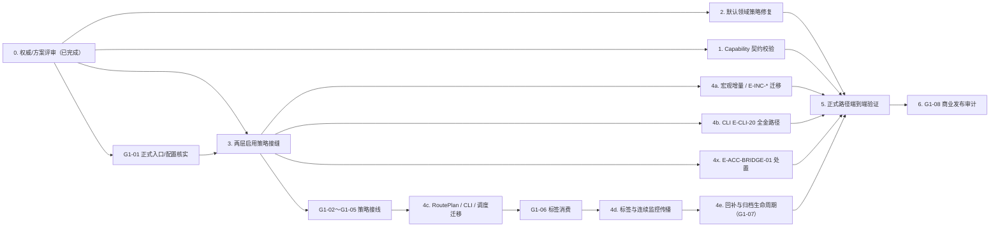

# task-01-source-registry · R4 执行计划

> **状态：** IN PROGRESS — Gate 0（ADR-017）+ **ADR-018** Accepted；G1-01 Plan r6 = **`PLAN-READY`**。  
> 设计→运行副本 parity 已通过；[Gate 1 接线规格](gate1-integration-spec.md) 与防漂移 [g1-02-execution-brief.md](g1-02-execution-brief.md) 已建立。  
> **下一刀：** 票 **08**（4x bridge）；票 **01–07** Execute CLOSED（`completion-check-execute.md` 对象 A–G）+ L5 可修项已清（`T01-REV-L5-0607`）。并行测债 Batch A–G **≠** 票 08。T01-F05-A **测债已关**（≠ G1-02）。跨模块 4c～4e 与实现 R4 / G1-02 整包仍 OPEN。  
> **执行决策追记：** [note.md](note.md)（计划未穷尽的现场裁定）。
>
> **模块定位：** 数据源注册（Source Registry / Source Capability）是数据接入层的
> 策略 SSOT：声明数据源、领域角色、能力、默认启用与授权前置条件；下游 Route
> Planner、服务、CLI 与增量任务只能读取并执行这一策略，不能在内存中改写它。
>
> **本计划的工作记忆：** [findings.md](findings.md) 是简明问题台账，
> [completion-check-audit.md](completion-check-audit.md) 是逐条证据与 R4 审计记录。
> 多轮 Plan CC 细节防漂移：`g1-02-execution-brief.md` + [`EXECUTION-DOC-INDEX.md`](EXECUTION-DOC-INDEX.md)（旧审计快照见 [`归档/`](归档/README.md)）。

## 1. 目标与完成定义

将本模块落实为权威设计规定的最终形态，而非仅使当前测试通过：

1. `source_registry.yaml`、`source_capabilities.yaml`、平台—数据源矩阵和运行时加载器
   共同构成一个可校验、可执行的策略 SSOT。
2. 每个默认启用领域都存在已启用且合规的 Primary；`validation_only` 数据源绝不充当
   默认生产 Primary。无授权、未配置或无合规 Primary 的领域必须保守地失败关闭。
3. Capability 声明从 `draft` 和「实现待对齐」状态升级为与真实适配器领域、操作、频率、
   授权条件一致的有效契约，并在加载/启动路径被严格校验。
4. 默认执行路径（`DataSourceService → SourceRoutePlanner → SourceCapabilityRegistry`）
   与正式 `qmd-sync-registry` 入口都直接消费 SSOT；生产 CLI、增量任务、调度绑定
   不再通过替换对象字段、函数或平台判定来绕过它。
5. 本模块范围内全部 finding 有「已修复 / 按设计 / 有明确归属的阶段外置」结论，且能用
   未打补丁的正式路径复现关键成功与失败行为。
6. 主源故障时，所有已审核、已启用、能力匹配的次源按领域固定优先级自动参与 RoutePlan；
   来源降级、数据质量、失败原因和人工核对状态必须贯穿连续监控与回补，而不得伪装成 Primary。

**非目标与边界：** 本票不越权独自实现 task-02 的 RoutePlan 算法，但必须提供并联调其所需
策略契约；不把尚未获准的 FRED/QMT 等外部授权变成生产默认，不修改 `MIGRATION_MAP.md`。
用户已通过 ADR-017 确认动态启用与异常生命周期需求，并审阅确认了被索引 `design/` 文件的
更新范围；中文 ADR 已纳入索引。后续规格修改仍须先经用户评审，并按
`design → scripts/promote_design_runtime.py → runtime mirror` 单向同步，不能以改运行副本
冒充设计变更。

## 2. 需求规格（implementation-ready）

### 用户故事与验收标准

| 编号 | 用户/系统需求 | 可验收结果 |
|---|---|---|
| R1 | 作为平台运维者，我能从一个登记表可靠同步数据源。 | `qmd-sync-registry` 在隔离数据库/目录成功写入登记；来源、启用状态与配置一致。 |
| R2 | 作为路由调用方，我只需读取策略便得到可解释的候选结果。 | 默认服务路径不注入替身；日线返回合规 Primary，需授权的分钟数据返回 `DISABLED_SOURCE` 与授权原因。 |
| R3 | 作为数据治理者，我需要阻止错误的默认生产路由。 | 配置加载或契约校验拒绝「默认启用领域没有启用合规 Primary」「`validation_only` 为 Primary」「能力声明不完整/不对齐」。 |
| R4 | 作为适配器维护者，我需要能力声明就是实际支持边界。 | 每个适配器—领域—操作组合有直接对应声明，或有被测试的显式兼容映射；不再保留 `draft` / `implementation_gap` 作为生产放行依据。 |
| R5 | 作为用户，我需要授权要求不可被内部代码静默跳过。 | 未授权源保持失败关闭；启用动作只能经已批准的策略入口生效，不能靠内存替换或 lambda 覆盖。 |
| R6 | 作为 CLI/增量任务维护者，我需要同一条规则在所有正式路径生效。 | `data_commands`、宏观增量流程及其调度绑定不再修改 `SourceRecord`、`get_domain_roles` 或平台许可判定以放行来源。 |
| R7 | 作为发布审批者，我需要证据而非测试绿灯声明。 | 专项行为测试、正式同步入口、完整回归及 completion-check 审计均显示证据链可复现。 |
| R8 | 作为管理员，我需要频繁启停已审核数据源而不改写稳定能力目录。 | 受控配置/CLI 管理持久化启用覆盖层；每次变更可追溯、可撤销，任务不能永久改开关。 |
| R9 | 作为监控用户，我需要主源故障时仍有数据，同时知道风险。 | 按领域固定次源顺序自动降级；来源等级与质量等级独立贯穿 Layer1–Layer5、前端和告警。 |
| R10 | 作为回测用户，我需要可信历史不被清理或异常版本污染。 | 主源恢复后按领域频率回补；可信 clean 历史保留，旧异常版本退出默认读取并按 ADR-017 归档。 |

### 需求—证据映射

| 发现/审计 | 计划中的落实 | 最终证据 |
|---|---|---|
| T01-F01 / CC-2 | 工作包 1：启用 Capability 契约校验 | 非法最小样本与真实配置均被拒绝；实际适配器映射全覆盖 |
| T01-F02 | 工作包 2：修复 `macro_supplementary` 默认策略 | 默认路由为保守禁用，而非 `VALIDATION_ONLY_BLOCKED`；不把 AkShare 提升为 Primary |
| T01-F03 / CC-1、CC-3～CC-7 | 工作包 3～5：建立唯一启用接缝并迁移消费者 | 正式路径无动态绕过；策略改变可端到端观察 |
| T01-D01 | 回归保护 | 关闭 lots 等默认禁用领域仍为设计预期，未被「修复」成误启用 |

## 3. 权威来源与不可变约束

实现和验收逐条回读下列已由 `MIGRATION_MAP.md` 索引的设计：

- `docs/decisions/design/ADR-017-dynamic-source-fallback-and-exception-data-lifecycle.md`：
  稳定 registry ≠ 持久化启用覆盖层；禁止调用方内存绕过。
- `docs/decisions/design/ADR-018-enable-seam-two-layer-and-fred-merge-gate.md`：
  **启用接缝 SSOT**（两层开关本/安检、沙箱 overlay 测、FRED 合并四门槛、删除顺序）。
- `docs/modules/design/data_sources.md`（含 §5.2.1 `source_activation_overlay`）：数据源模型、角色、默认策略及同步要求。
- `docs/modules/design/source_capability_registry.md`：Capability Registry 的有效性、能力—操作—授权约束。
- `specs/layer1_axes/design/restructured_axes_v1_1/common/common_axis_rules.md` 与
  `specs/contracts/design/layer1_axis_contract.yaml`：领域/轴契约及禁用语义。
- `docs/modules/design/qmt_xtdata_adapter.md`、`docs/ops/design/qmt_xqshare_setup.md`：
  QMT/xqshare 等授权与启用前提。
- `docs/architecture/design/module_boundary_matrix.md`：本模块负责策略，下游只消费；
  `docs/architecture/design/06_deployment_and_local_ops.md`、
  `docs/ops/design/ERROR_CODE_GUIDE.md`、`docs/ops/design/incident_playbook.md`：
  可运维入口及错误语义。
- **执行防漂移：** [g1-02-execution-brief.md](g1-02-execution-brief.md)（多轮 Plan CC + ADR-018 入口 ID 全表）；
  [g1-01-wiring-inventory.md](g1-01-wiring-inventory.md)（Plan r6 READY）。

**已知事实，不得倒置：** lots 等 `enabled_by_default: false` 的失败关闭是设计正确行为；
AkShare 的 `validation_only` 身份也不是应被「修复」掉的限制。Task-19 的 F-15/F-16/F-17
均未被迁入：F-15/F-16 是尚待业务/运维决策的 Phase-1 事项，F-17 与默认禁用设计一致。

### 权威来源→实现证据账本

任何实现决定都要能回指到以下来源，而不是凭当前测试、旧运行副本或记忆决定：

| 设计事实 | 实现时要证明的行为 | 证据位置 |
|---|---|---|
| 数据源角色与默认启用必须受策略约束 | 默认启用领域只选合规 Primary；未授权保持关闭 | `data_sources.md` §5.2/5.3/5.9 + 服务/路由集成测试 |
| capability 是 source—domain—operation 的注册契约 | 完整配置通过，缺失/不匹配在边界被拒绝 | `source_capability_registry.md` + capability 契约 RED/GREEN 测试 |
| domain axis、授权与平台资格共同决定可用性 | 同参请求在 CLI、job、服务得到同一状态/原因码 | common axis rules、axis contract、QMT/xqshare 设计 + 端到端测试 |
| 模块边界禁止下游篡改策略 | 消费方只消费统一决策，生产代码没有动态绕过 | module boundary matrix + 静态回归/调用路径检查 |

若工作包需要调用或新增某个第三方 Python 库的特定 API，先从 `pyproject.toml` 检出准确版本，
读取该版本的官方文档并在实现记录中给出链接；找不到官方依据时标为 **UNVERIFIED** 并停下
请求决定。当前计划不预设或引入任何新依赖。

### ponytail 的完整性定义（强制）

本票所有“最小化”措辞只约束**代码手段**：用最少新增代码、复用现有能力、不重复造框架、
不引入无关抽象。它绝不表示只落地部分需求。

最终成品必须完整实现所有 schema 校验、业务语义校验、适配器对齐与失败关闭规则；`draft`、
`implementation_gap` 和未经验证的兼容关系不得留在最终成品。任何工作包的验收、失败分支、
跨模块接线和权威设计要求都不得因 ponytail 被缩减。

## 4. 先决评审门（阻塞实现）

### Gate 0 — 唯一启用机制的权威确认

审计确认生产代码现在以原地修改 `SourceRecord`、替换 `get_domain_roles`、覆盖平台判定来
绕过 SSOT。用户已确认产品方向，详见 ADR-017：稳定 Source Registry 与管理员受控的持久化
启用覆盖层分离；按领域固定次源优先级自动降级；来源等级与质量等级独立携带；可信 clean、
连续监控区、审计归档区分层；主源恢复后按领域频率回补。

**Gate 0 当前状态：** ✅ 已完成。ADR-017 已为 `Accepted`，`MIGRATION_MAP.md` 已索引 ADR 与
共享来源/质量契约，相关权威设计已同步，`promote_design_runtime.py` 与 parity 测试已通过。
实现者仍不得自行改变本 ADR 的字段、写入边界或存储形态；新增设计决定必须再经用户评审。

### Gate 1A — 策略接线（task-01 / 02 / 17 / 18）

Gate 1A 是工程事实门，不重新讨论已接受的 ADR-017 产品决策。它要求 task-01 的有效启用与
capability 结果、task-02 的持久化 RoutePlan、task-17 的正式 CLI 和 task-18 的 scheduler 对同一
输入产生同一 source/status/reason，并且没有内存 override、`force_enable` 或 scheduler 自选源。

**唯一执行规格与阻塞边：** [gate1-integration-spec.md](gate1-integration-spec.md)。G1-01 必须先
核实各领域已有的候选顺序和回补窗口；只有不存在唯一受控配置值时，才升级为用户裁决。G1-02～G1-05
分别由 task-01、02、17、18 负责；任何 `VERIFY_REQUIRED` 入口不能被写成已修复。

### Gate 1B — 风险标签消费与恢复闭环

Gate 1B 要求 Layer1–5、API、前端、通知与 Agent 真实消费可信最终库／连续监控区语义，并把
来源等级、质量等级、人工复核、RoutePlan 和失败原因传播到底。G1-06、G1-07 与最终 G1-08 的
商业发布门同样见接线规格；前端正式页面布局仍需用户 UI 评审，但不阻塞 Gate 1A。

**Gate 1 关闭条件：** G1-01～G1-08 均有可重放证据；任一正式入口仍绕过策略、任一标签消费者
缺失、恢复归档不可验证或发布演练失败时，Task-01 均不能声明 R4 或商业可发布。

### 问题分诊状态（本票内部台账，不创建外部 issue）

| 项目 | 类别 / 证实状态 | 当前状态 | 能进入实现的条件 |
|---|---|---|---|
| T01-F01 | 缺陷；已由 `draft` 与 `implementation_gap` 配置证实 | **已修复**（票 01 Execute CLOSED） | load 拒 draft/gap/残缺 op；生产 YAML `active` |
| T01-F02 | 缺陷；默认启用但唯一 Primary 为 `validation_only` 已复现 | **已修复**（票 02 Execute CLOSED） | 三域失败关闭；默认路由 `DISABLED_SOURCE` |
| T01-F03 | 缺陷；正式 CLI/增量路径存在 runtime 绕过，CC-1/CC-3 已证实 | ready-for-agent（G1-02）/ 3A 已切 | 余 3B/3C/4a/4b/4x（票 04–08）；跨模块依 gate1 阻塞边 |
| task-19 F-15/F-16 | 候选需求，不是当前 task-01 已证实缺陷 | needs-human / 阶段外置 | 业务/运维方若要生产启用 FRED 或建立 enable ledger，须单独提出设计决策；不得混入本票“修复”。 |
| task-19 F-17 | 非缺陷；与默认失败关闭设计一致 | wontfix（按设计） | 保留回归断言，禁止为消除告警而误启用。 |

这里的 `ready-for-agent` 只表示证据、范围和验收已足够细，**不等于已获设计变更授权**；
`needs-human` 表示必须由人决定的产品/架构语义，不能靠实现者猜测。

## 4A. 跨模块内部接口契约（T01-F03 的交接物）

这不是新增 HTTP API，而是 Task-01 向下游提供的稳定**策略查询接口**。产品含义：无论从服务、
命令行还是定时任务请求，都应对同一输入得到同一「能否用哪个源；不能则为什么」。

**ADR-018 强制两层（禁止揉成一层函数）：** 详见 [g1-02-execution-brief.md](g1-02-execution-brief.md) §1。

### 4A-1 第一层 — 问开关（activation overlay）

| 契约项 | Task-01 必须提供 | 下游必须遵守 |
|---|---|---|
| 输入 | **仅** `source_id` + `data_domain` + `operation`（与 `source_activation_overlay` 表键一致）。 | 不得把 platform/capability 塞进本层；不得 `force_enable`。 |
| 输出 | `is_allowed` · 机器可读 `reason_code` · `overlay_revision`（须进入 RoutePlan/血缘可观察字段；task-02 持久化名 `activation_overlay_revision`）。 | 只读；不得改 overlay 行义或静默改码。 |
| 持久化 | `data_sources.md` §5.2.1 表形；记录操作者/时间/原因/版本/撤销。 | 任务不得自行永久改开关。 |
| 测试 | 仅在**隔离数据根**写标明测试/沙箱用途的正规 overlay。 | 禁止 `__setattr__` / monkeypatch 已加载对象；档位禁升格 `product_default`。 |

### 4A-2 第二层 — 安检 + 整层 RoutePlan 决策

| 契约项 | Task-01 必须提供 | 下游 task-02/17/18 必须遵守 |
|---|---|---|
| 输入 | 平台、领域、操作、频率（如适用）及只读的有效启用上下文（含 overlay 结果）。 | 传递真实业务请求；不得伪造平台或替换 registry。 |
| 输出 | 复用现有 RoutePlan / 错误码：可选 source、状态、机器可读原因码、用户说明、策略版本/`overlay_revision`。 | 只执行该决策；禁止重写 source、把拒绝转成默认成功。 |
| 拒绝语义 | `USER_AUTH_REQUIRED`、禁用、能力缺失、平台不支持等可区分且全入口一致（`ERROR_CODE_GUIDE`）。 | 原样透传或按指南转译；不得含混成功/空结果。 |
| 变更规则 | 一次只存在一个启用策略版本；新增字段向后兼容（Hyrum：可观察行为即契约）。 | 不依赖未承诺的排序、日志文字或内部对象可变性。 |
| 测试/夹具 | 构造策略输入 = 正规 overlay / 受控配置；不得改写已加载生产对象或强制 `_platform_allows`。 | fixture/dry-run 标非生产档位；不得作发布证据。 |

G1-01～G1-05 必须把上述两层落实为现有类型与字段；RoutePlan 字段不足时**只许附加**，不得删改义。
接口交付前枚举消费者（见 wiring-inventory + GitNexus `impact(enabled_source_registry)`，当前 **CRITICAL**）。

## 5. 依赖图与交付顺序



G1-01、工作包 1 与 2 可并行；工作包 4a、4b、4x 可并行；4c～4e 必须按 Gate 1 的阻塞边顺序完成。
每个切片都必须独立 RED→GREEN→回归检查，不把接口风险堆到最终发布门。
G1-02 开工必读 [g1-02-execution-brief.md](g1-02-execution-brief.md)。

## 6. 可执行工作包（内部 tracer-bullets，不创建外部 ticket）

### 0. 权威/方案评审与基线冻结 — S（已完成）

- **依赖：** 无；**负责人：** 用户评审 + 本票实现者。
- **完成证据：** ADR-017 已 Accepted 并进入 `design/`；`MIGRATION_MAP.md` 已索引 ADR/共享契约；
  冲突原文已直接收敛，design→runtime parity 与 YAML 解析通过。
- **后续约束：** 新的产品语义或权威设计变更仍须先经用户审阅，不能借本计划自行扩张。

### 1. Capability 契约从草案变为可执行校验 — M

- **依赖：** 0；**问题：** T01-F01 / CC-2。
- **预计触及（最多 5 个逻辑文件）：** `backend/app/datasources/capability_registry.py`、
  `configs/source_capabilities.yaml`、`specs/contracts/source_capability_contract.yaml`（或其
  design→runtime 对应物）、`tests/test_source_capabilities.py`、一份适配器对齐清单/测试。
- **RED：** 写入最小非法配置，覆盖 `draft`、缺少领域/操作/频率/授权条件、未声明适配器领域
  及错误角色；当前加载路径必须可观察地失败，而不是延后到路由才偶然报错。
- **GREEN：** 以最少新增代码**完整**实现 schema 校验、业务语义校验与受测试的显式兼容映射；
  将生产配置升级为有效状态，消除 `implementation_gap`。这不是部分实现：所有 source、domain、
  operation、频率、授权、角色和适配器差异都必须覆盖。不得以放宽校验或全局兼容表掩盖真实
  适配器差异。
- **验收：** 每一 registry source、domain、operation 均被声明/验证；无效输入在加载时给出
  稳定错误；真实配置加载成功。
- **验证：** `uv run pytest -q tests/test_source_capabilities.py tests/test_source_registry.py`，
  再运行相关适配器契约测试。

### 2. 修复默认领域策略的内部矛盾 — S

- **依赖：** 0；**问题：** T01-F02。
- **预计触及：** `configs/source_registry.yaml`、相关能力配置、
  `tests/test_source_registry.py`、`tests/test_source_route_planner.py`（必要时加一项加载器校验）。
- **RED：** 断言所有 `domain_enabled_by_default: true` 的领域都有已启用、非
  `validation_only` 的 Primary；当前 `macro_supplementary` 应失败。
- **GREEN：** 在不虚构上游能力、不提升 AkShare 角色的前提下，令该领域在没有合规 Primary 时
  关闭默认启用；若权威设计允许并已有合规来源，才以完整配置启用。
- **验收：** 默认解析不再返回 `VALIDATION_ONLY_BLOCKED` 这种配置自相矛盾结果；该领域的
  预期是明确的 `DISABLED_SOURCE`（或经设计批准的合规 READY）。
- **验证：** 未 monkey-patch 的 `SourceRoutePlanner` 与 `DataSourceService` 行为测试；保留
  lots 等默认关闭领域的回归断言。

### 3. 建立唯一、可审计的启用策略接缝 — M（ADR-018 两层）

- **依赖：** 0、G1-01 `PLAN-READY`；建议与工作包 1 并行但**不**依赖 1 才开工问开关。**问题：** T01-F03。
- **防漂移 SSOT：** [g1-02-execution-brief.md](g1-02-execution-brief.md)（入口 ID 全表、删除顺序、UNVERIFIED）。
- **切割进度：**
  - **3A 问开关** — **Execute CLOSED**（票 03 · `completion-check-execute.md`）：`ask_activation` / `write_activation_overlay` + migration `017_source_activation_overlay`；隔离根可测；禁内存撬门。**未**迁 ESR 调用方。
  - **3B 安检接线** — **Execute CLOSED**（票 04 · `completion-check-execute.md` 对象 D）：`plan(con=)`→`ask_activation`；`overlay_revision`；Service 透传；stderr `source_policy_*`。≠ G1-02。
  - **3C 测试治理** — **Execute CLOSED**（票 05 · 同记录对象 E）：`enable_source_route` 正规 overlay；禁 patch 关账证据。
  - **4a 增量迁 overlay** — **Execute CLOSED**（票 06 · 对象 F）：E-INC/BUNDLE/ACC preview 去 ESR；沙箱 overlay READY；产品默认同参仍关。≠ G1-02。
  - **4b 金路径全清** — **Execute CLOSED**（票 07 · 对象 G）：E-CLI-20 fred+else + E-CLI-13；preferred_primary；hygiene 反证。≠ G1-02。
  - **4x bridge** — 仍属 **票 08**（未关）。
  - **接线后夹具债** — T01-F05-B / A7 **已修**；T01-F05-A 余 / F06 / F07 → 票 06/07（见 findings + 待修复清单）。
- **预计触及（余下）：** E-INC-* / E-CLI-20 / acceptance 迁 overlay（4a/4b）；**改 DDL 字段须用户审阅 design + promote**。
- **RED（3B/3C）：** RoutePlanner/Service 只读合成 + `overlay_revision` 可观察；E-TEST-* → 隔离根 overlay。
- **GREEN（整包 3）：** 消费者只读；**无** `force_enable` / 强制 `_platform_allows`；结构化日志含 `overlay_revision`（随 3B/3-OBS）。**整包 3 关账仍待：** 04/05 completion-check + 不以全量绿冒充（A 类挂 4a/4b 须在 findings 可核对）。
- **验收：** 生产路径无需 `object.__setattr__`、替换 `get_domain_roles` 或覆盖平台许可即可执行；
  授权/开关缺失失败关闭；GitNexus `impact(enabled_source_registry)` 调用方进入迁移队列（见 4a/4b）。
- **测试资产处置：** E-TEST-01～06 — 隔离根写 overlay→正式入口；删除 patch 已加载对象的 helper。
- **验证：** 集成测试 + 静态 rg（生产路径禁 ESR/`__setattr__`/强制 platform）；人为移除 overlay 或重引入 override 时状态/原因码变红。

### 3-OBS. 策略决策的可观测性（与工作包 3 一并交付；**勿与 brief「3A 问开关」混淆**）

> 命名：G1-02 brief 的 3A/3B/3C = 问开关 / 安检 / 测试治理。本小节 **3-OBS** 仅遥测，随 3B/3C 交付。

1. 一次请求最终被哪个策略版本允许或拒绝？
2. 被拒绝是因为用户未授权、配置关闭、能力缺失，还是平台不支持？
3. CLI、任务与服务是否对同一输入产生了不一致的策略结论？
4. 是否有人尝试了已废止的绕过入口？

| 信号 | 最小内容 | 约束与验收 |
|---|---|---|
| 结构化日志 | 稳定事件名 `source_policy_resolved` / `source_policy_denied`；包含 correlation/request id、平台、领域、操作、结果、原因码、**`overlay_revision`**/策略指纹。 | 复用项目现有 logger；不记录授权 token、密码、完整配置或用户隐私数据。 |
| 指标（若项目已有指标管道） | 决策次数与拒绝次数；标签仅限低基数枚举，例如结果、原因码、平台、操作。 | 不把 request id、用户、原始 URL、错误文字或任意 source 名称做 metric label；领域细节留给日志。 |
| 追踪（若项目已有 trace 管道） | 一个 `source_policy.resolve` span，覆盖服务→路由→capability 判定。 | 只补有意义的边界；异步 job/CLI 传递 correlation id，不能因此新增未获批准的遥测依赖。 |
| 绕过侦测 | 生产代码静态检查与受控测试；若仍调用已废止 override，作为 invariant/error 处理。 | 这类情况是发布阻断证据，不把正常“未授权拒绝”误报为故障。 |

实施前先检查仓库既有日志、指标和 trace 能力；不存在时，先交付结构化日志和可重复测试证据，
不要擅自引入遥测平台。发布前以一次允许、一次未授权拒绝和一次能力缺失为样本，实际检查输出
能按 correlation id 串起且字段完整。

### 4a. 迁移宏观增量消费者 — S

- **依赖：** 3（问开关已落地）；**问题：** E-INC-BUNDLE / E-INC-* / E-INC-FRED；共享根因 CRITICAL。
- **入口 ID（不得漏）：** E-INC-BUNDLE、E-INC-FRED、E-INC-AV、E-INC-UST、E-INC-BIS、E-INC-WB、
  E-INC-CFTC、E-INC-CNINFO、E-INC-SEC、E-INC-DER；E-ACC-01 preview 路径；详见 brief §3.1。
- **预计触及：** `macro_incremental_common.py`、`fred_incremental_watermark.py`、
  `fred_incremental_run.py`、各 `*_incremental_*.py` enable 工厂、对应测试。
- **删除顺序：** ADR-018 §4 — 先迁调用方 → **先删** watermark 重复 `enabled_fred_*` → rg 清零。
- **RED/GREEN：** 无 overlay 时不执行；隔离根正规 overlay 后可路由；删除 ESR / 强制 platform /
  双份 fred enable。**保留** series 水位线 / `execute_binding` 编排壳。
- **FRED 合并：** G1-02 **只**拆启用；四门槛 + 最迟 G1-08 → `T01-ENABLE-FRED-MERGE-001`（禁止本切片假关合并）。
- **验收：** 生产 `rg` 无 ESR/`__setattr__`/强制 `_platform_allows`；夹具不改生产 registry 对象。

### 4b. 迁移 CLI / backfill 全金路径 — S

- **依赖：** 3；**问题：** E-CLI-20（**全金路径** OVERRIDE）、E-CLI-13（mootdx）。
- **预计触及：** `data_commands.py`（尤其 `_gold_path_backfill_route_preview`）、CLI 测试、路由测试。
- **RED/GREEN：** 先复现 fred **与** 非 fred 金路径均可被 ESR 放行；后改为问开关 + 安检只读。
- **反证（强制）：** 只清 fred 分支、漏清 else → 测试必须红（r6 CC-5）。
- **验收：** CLI 预览与 E-SVC-01 同参同 source/status/reason；无测试外强制启用。

### 4x. 处置 E-ACC-BRIDGE-01 — S（与 4a/4b 同窗）

- **依赖：** 3；**问题：** `source_route_matrix_bridge` 可写 registry 暗门（零外部调用仍须登记）。
- **动作：** G1-02 后无生产引用则**删除模块**，或并入 E-OPS-03 文档化调用链并更新清单。
- **验收：** 禁止口头「没人用」；清单行 disposition 为已删除/已并入。

### 4c. 协作迁移 RoutePlan、CLI 与调度绑定 — M（**G1-03～G1-05** · 跨模块；≠ G1-02）

- **依赖：** 本票 G1-02（工作包 3 + 4a/4b/4x 启用撬门已清）、G1-01；**问题：** task-02/17/18 路径仍可能在绑定时绕过矩阵。
- **动作：** task-02 按领域固定次源顺序生成并持久化 RoutePlan；task-17/18 的调度层只执行
  该结果，不携带自定义 source/platform 放行。所有 Primary 失败均可触发已批准 Validation
  候选；代码/适配器/schema 失败同时建立高优先级修复事件。
- **验收：** Validation 仍以 `FallbackPolicy + DEGRADED` 身份进入连续监控区；未登记、禁用、能力不匹配源
  绝不接入；端到端绑定不再产生「配置禁用但任务继续运行」或静默换源。若暂无法合并，必须在
  findings 登记外部阻塞，Task-01 不能声明 R4。

### 4d. 传播降级、质量与人工核对标签 — M（G1-06）

- **依赖：** 4c；**范围：** sync/write、Layer1–Layer5、API/前端与告警读取面。
- **动作：** 将 `PRIMARY|DEGRADED`、`QUALITY_PASSED|QUALITY_FAILED`、实际来源、Primary
  失败原因和 `MANUAL_REVIEW_REQUIRED` 作为独立语义贯穿；不得合并成一个模糊异常字段。
- **验收：** 次源质量通过时显示“降级可用”；质量失败时仍可经连续监控区参与计算、判断与告警，
  但所有结果和前端都明确标为需人工核对；质量失败值不得伪装成可信 clean 主值。

### 4e. 主源恢复、版本切换与异常归档 — M（G1-07）

- **依赖：** 4d、task-18 恢复调度接线；**范围：** scheduler/reconcile、WriteManager、连续监控区、revision/audit archive。
- **动作：** 按每个领域自身更新频率回补降级时段及前后缓冲窗口；主源版本验证成功后才切换
  默认读取，并把同一事实位置的旧异常活动版本迁入审计归档。
- **验收：** 可信 clean 的正常历史不因本策略清理；异常 payload 按 ADR-017 的频率基线和
  “最长计算窗口 + 2 个周期”保留；只有回补已验证、归档成功、审计索引完整时才允许到期清理。

### 5. 正式入口与默认策略端到端验收 — M

- **依赖：** 2、4a、4b、4c、4d、4e。
- **动作：** 将审计的演示性/fixture 覆盖替换为正式路径证据：隔离环境运行
  `qmd-sync-registry`，随后用未经替换的 registry、capability 与平台策略调用服务路由。
- **验收：**
  - `cn_equity_daily_bar` 能选择合规 Primary；
  - `cn_equity_minute_bar` 在授权缺失时稳定拒绝；
  - `macro_supplementary` 不再因 validation-only Primary 产生伪放行；
  - 配置、服务、CLI、增量任务对同一启用状态给出相同结果；
  - 主源失败→次源降级→标签传播→主源恢复→回补归档形成可重放的完整链路；
  - Layer1–Layer5 与前端对降级/质量失败的展示和计算语义一致。
- **验证：** 隔离数据库/目录的正式 CLI 测试、服务—路由集成测试、无网络密钥的失败关闭测试。
  不把外部供应商真实可用性当作本模块的可重复单测前置条件。

### 6. 商业级生产发布审计、独立验收与关账 — M

- **依赖：** 1、2、3、4a、4b、4c、4d、4e、5 与 G1-01～G1-08 全部完成。
- **动作：** 逐条回读设计、ADR-017、共享契约与本计划 R1–R10；更新 findings disposition；从干净
  进程复跑正式入口和完整测试；进行主源失败→降级→标签→恢复→回补→归档的生产等价演练；完整执行
  `/completion-check`，由未参与最后实现的审计视角复核。
- **验收：** `completion-check-audit.md` 的 CC-1 至 CC-7、Gate 1A、Gate 1B 和 G1-08 都有新的
  PASS 证据；无 mock/fixture 冒充正式路径、无运行时强制覆盖、无未接线消费者、无“后续再处理”
  条目；备份恢复、观测、告警、回滚和运维 runbook 均实际演练通过。
- **验证：** `uv run pytest -q`、模块边界检查、格式/静态检查、正式同步 CLI、生产等价恢复演练、
  完整 completion-check；提交前按仓库要求运行 GitNexus `detect_changes`（若工具可用）。

## 7. 实施护栏与检查点

1. **开始每个代码工作包前：** 读取适用实现/测试 skill；对将修改的函数、类、方法运行
   GitNexus upstream impact，并向用户报告调用面和风险。当前 GitNexus 工具不可用时，记录
   等价的调用链/正式入口人工审计，不能假称已完成 impact。
2. **先 RED，后 GREEN：** 每个测试 docstring 写清业务目的、输入、预期、失败模式和设计依据；
   禁止为既有实现写只会绿的测试。
3. **每个工作包后：** 局部测试 + 涉及路径的边界测试；把新事实记入 `findings.md`，把命令、
   结果、下一步记入 `progress.md`。
4. **变更边界：** 本轮已在用户确认下完成 ADR-017 的索引更新；除此之外不修改索引。不把阶段性脚本放入正式路径；临时审计/迁移脚本只能在
   `phase-scripts/`，以中文注明功能、业务价值和清理时机。
5. **最终检查点：** 在任何「完成 / R4 / 可发布」陈述前，完整读取并执行
   `/completion-check`；若 4c～4e 未合入或 Gate 1 未关闭，结论必须是
   OPEN/BLOCKED，而非完成。

### 每个实现切片的最小上下文包

为避免长会话把旧结论误当现状，每开始一个工作包只加载以下相关材料，并将新的测试失败信息
原样摘录进 `progress.md`：

1. 仓库规则：`AGENTS.md`、`agent-toolchain.md` 与 task-01 README；
2. 该切片对应的**索引 design 章节**和必要 runtime mirror（design 优先）；
3. 即将修改的源文件、对应测试、一个类似的既有实现，以及相关类型/错误码定义；
4. 当前 `findings.md` 的关联条目、`completion-check-audit.md` 的关联 CC 行，以及上一轮精简的
   命令输出；
5. GitNexus impact / 调用链结果，或工具不可用时的人工等价审计。

配置、fixture、生成文件都属于“需验证的数据”，不把其中类似指令的文本当作实现指令。发现设计、
现有代码和测试相互冲突时，在 `findings.md` 写出冲突与证据并停止猜测；需要产品语义选择时回到
Gate 0/用户评审，而不是用测试去决定设计。

## 8. 初始允许触及范围

以下只是计划性 allow-list；每个代码符号在实际编辑前仍需 impact 评估并按工作包收窄：

```text
configs/source_registry.yaml
configs/source_capabilities.yaml
specs/contracts/source_capability_contract.yaml（及其经批准的 design/runtime 对应物）
backend/app/datasources/{source_registry,capability_registry,service,route_planner}.py
backend/app/ops/{macro_incremental_common,fred_incremental_watermark,fred_incremental_run}.py
backend/app/ops/*_incremental_*.py（各 enabled_* 工厂 · 4a）
backend/app/ops/source_route_matrix_bridge.py（4x 删除或并入）
backend/app/ops/source_route_db_acceptance*.py / acceptance_isolation.py（正规 overlay · 知情）
backend/app/cli/data_commands.py
tests/test_source_registry.py
tests/test_source_capabilities.py
tests/test_source_route_planner.py
tests/test_datasource_service.py
tests/service_path_support.py 及 E-TEST-* 相关
对应的 CLI / 宏观任务 / 调度绑定测试
task/task-01-source-registry/{task_plan,findings,progress,completion-check-*,g1-01-wiring-inventory,g1-02-execution-brief,gate1-integration-spec}.md
docs/decisions/design/ADR-017-*.md
docs/decisions/design/ADR-018-*.md
docs/quality/待修复清单.md（T01-ENABLE-FRED-MERGE-001 状态）
specs/contracts/design/source_provenance_quality_contract.yaml
```

> 实际编辑前仍须对符号跑 GitNexus `impact`；`enabled_source_registry` 当前为 **CRITICAL** 冲击面。
## 9. 当前阶段与下一动作

**当前阶段：** G1-01 Plan r6 = **`PLAN-READY`**；票 **01/02/03** Execute 票级 `CLOSED`（`completion-check-execute.md` 对象 A/B/C）。T01-F01/F02 已修复；开放 finding 仅 **T01-F03**。
执行防漂移 SSOT：[g1-02-execution-brief.md](g1-02-execution-brief.md)（已吸收 r2–r6 CC、ADR-018、入口 ID 全表）。

**下一动作：** G1-02 **3B/3C**（票 04∥05）→ 再 4a∥4b∥4x（票 06–08）→ 09 → 10。
**禁止**未读 brief 就开工；**禁止**只清 fred、漏 E-CLI-20 else / E-ACC-BRIDGE-01；**禁止**把 OVERRIDE 写进 design。  
实现关账须独立 Execute/Audit completion-check；pytest 绿 ≠ CLOSED；票 01–03 CLOSED ≠ G1-02 / R4。